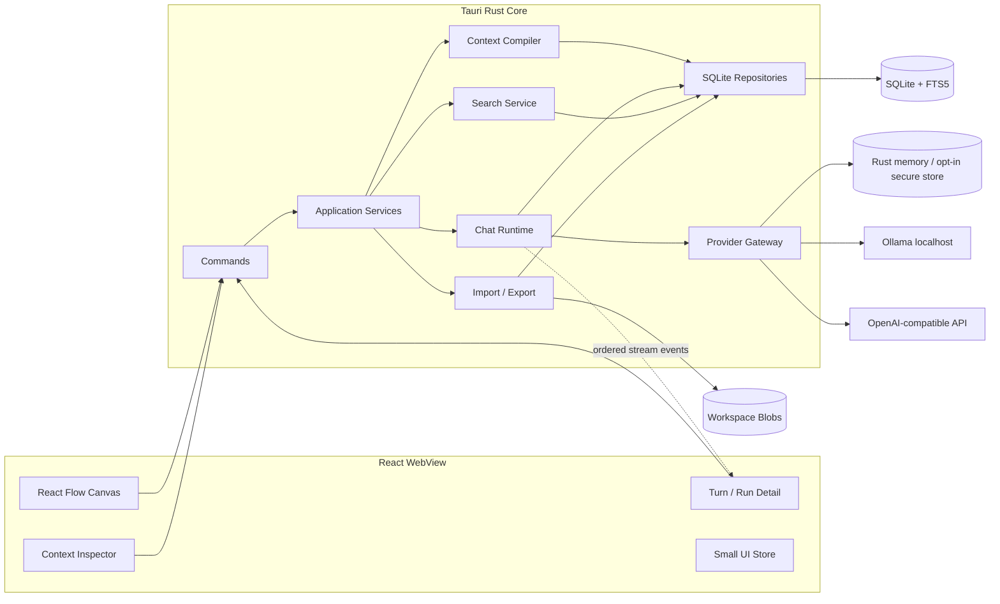

# 本地优先的思维导图式 AI 分支对话产品：需求验证与技术架构报告

> 调研日期：2026-07-15  
> 目标产品：桌面端、本地优先、树状/无限画布式 AI 对话；用户可从任意回答处分叉，并明确检查和调整模型实际收到的上下文。  
> **[推断] 结论先行：**需求真实、痛点强，但目前仍是高频 AI 用户的高价值细分市场，不是已被证明的大众刚需。最值得做的不是“把聊天画成脑图”，而是“可视化、可审计的上下文分支管理”。

## 0. 证据标签与阅读口径

- **[事实]**：本次直接观察到的平台页面、原帖、评论、互动字段、官方文档或官方仓库内容；正文邻近提供来源链接。
- **[推断]**：基于多个事实作出的市场归纳、用户分层、机会判断或风险判断，不等同于统计代表性结论。
- **[建议]**：产品、MVP 或软件架构决策；属于待实施、待测试方案，不描述现有产品已经具备的能力。

使用规则：第 2、3 节的样本、原话和平台字段默认属于 **[事实]**；第 1、4、5、23 节的市场归纳默认属于 **[推断]**；第 6–22 节的产品与架构方案默认属于 **[建议]**。混合段落会在句内单独标明。厂商自述只记为“厂商声明”，不升级为独立事实；互动量只代表抓取时公开关注，不代表付费、活跃或留存。

---

## 1. 执行摘要

### 1.1 需求是否存在

存在，而且跨平台、跨年份重复出现。公开讨论中的共同诉求不是普通 AI 脑图，而是：

1. 从某一条 AI 回答创建旁支，不破坏主线；
2. 子分支自动继承正确的父路径上下文；
3. 旁支内容不要污染其他分支；
4. 可以回到早期节点继续另一种推演；
5. 能看见、删减、固定或引用实际进入模型的上下文；
6. 长对话仍能定位结论，而不是在侧边栏里管理几十个相似聊天；
7. 敏感项目可以使用本地模型、本地数据和自有 API Key。

X/Twitter 上一条第一人称需求帖明确请求“从聊天中特定位置分支，同时不污染原始上下文”；抓取时可见约 **1,368 likes、26 reposts、41 replies、172 万 views**。另有多条独立用户帖请求同一会话内的 threaded chats、保留原主线与快速返回父节点。Reddit 上 2022–2026 年持续出现 conversation tree、fork、selective context、local/private chat 等讨论；其中既有明确需求，也有“为什么分支功能使用率不高”的反向信号。详见第 3 节。

### 1.2 市场判断

| 维度 | 判断 |
|---|---|
| 需求真实性 | **已验证**：多个社区独立、反复出现 |
| 痛点强度 | **高**：研究、开发、写作、复杂决策用户最强 |
| 普及程度 | **尚未验证为大众需求**：普通短对话用户感知弱 |
| 竞争状态 | 已有 ChatGPT 原生 fork、Twigg、Thoughtflow、Slashspace、Nodea、Chatvas、LibreChat 等；**尚无稳定品类标准** |
| 最大产品机会 | “树状分支 + 上下文可审计 + 本地优先 + 低认知负担” |
| 最大风险 | Demo 很吸引人，但树超过 30–50 个节点后可能比线性聊天更乱；留存尚无公开证据 |

### 1.3 推荐产品定义

不要定位为“AI 思维导图生成器”，也不要第一版就做 Agent 工作台。推荐定义：

> **一个本地优先的 AI 思考工作区：从任意回答处分支，沿选定路径继承上下文，并让用户在发送前看见 AI 此刻究竟能看到什么。**

一句话差异化：

> **Branch anywhere. See the context. Keep it local.**

### 1.4 推荐技术基线

第一版建议：

```text
Tauri 2
+ React + TypeScript + Vite
+ React Flow
+ 稳定的父子槽位放置（验证“一键整理”需求后再加 Dagre；不要先上 ELK）
+ Rust + Tokio + reqwest
+ SQLite（单连接起步、STRICT tables、FTS5；实测争用后再启用 WAL）
+ OpenAI Chat Completions-compatible provider
  - Ollama 作为预配置本地端点
  - OpenAI/vLLM/LM Studio/其他兼容服务作为自定义端点
+ 密钥默认仅驻留 Rust 进程；“记住”时再接 OS Keychain/Stronghold
```

首版不做：Agent、MCP 执行、向量数据库/RAG、CRDT、多端实时同步、多人协作、完整富文本编辑器、自动分支合并。

---

## 2. 调研方法、样本与限制

### 2.1 调研范围

本次同时覆盖：

- X/Twitter：需求原帖、插件发布帖、评论；
- Reddit：r/ChatGPT、r/ClaudeAI、r/LocalLLaMA、r/ObsidianMD、r/ADHD_Programmers 等；
- 小红书、抖音：中文公开搜索结果与可访问评论；
- Product Hunt、产品官网、官方 GitHub、App Store、OpenAI/LibreChat 官方文档；
- Tauri、React Flow、SQLite、Ollama、MCP 等官方技术资料。

使用了 TikHub MCP、Agent Reach/OpenCLI 可用后端、站点公开页面、官方文档和多路并行检索。检索失败与限制没有被当作“没有需求”的证据。

### 2.2 实际可核验样本

- X/Twitter：深读 **6 个相关线程、8 条可独立识别帖子**，另检视多组搜索结果；
- Reddit：执行 **11 组语义/站点查询**，检视约 **117 个结果槽位**，精读 **15 个线程**；最终纳入 **9 条主证据**和 **4 条反向/低使用信号**；
- 小红书：尝试 **8 组中文查询**和多轮站外定位；真实需求样本 **n=0、评论 n=0**，公开页无法返回可核验笔记卡；
- 抖音：检视 **5 组主查询、6 组以上补充定位词**，复核 30 余个去重视频候选，最终保留 5 条创作者级弱信号；可核验评论者样本 **n=0**；
- 竞品：核验 10 余款产品的一手页面或官方仓库。

### 2.3 限制

1. **不是随机抽样。** X 和 Reddit 天然偏向高频 AI 用户、开发者和早期采用者；不能外推整体 AI 用户渗透率。
2. **互动量不是付费与留存。** likes、points、stars 只能表示公开关注，不代表 MAU、转化率或长期使用。
3. **平台可访问性不一致。** 小红书页面主要返回登录壳；抖音结果弱且评论不可稳定访问；TikHub 若干调用出现超时；Reddit 一部分访问依赖公开镜像或搜索摘要。
4. **中文平台证据不足是“未验证”，不是“没有需求”。**
5. Product Hunt 存在发布日动员、早期采用者与创作者互评偏差。

---

## 3. 跨平台真实需求证据

## 3.1 X/Twitter：最强公开量化信号

### 强信号

一条回复 OpenAI 高曝光 power-user feature request 线程的第一人称需求帖，明确请求从聊天中的特定位置分支，同时不让 1–3 轮临时旁支污染原始上下文。抓取时可见约：

- 1,368 likes；
- 26 reposts；
- 41 replies；
- 1,724,539 views。

这条帖子处于高曝光征集线程，互动会被主线程放大；它证明痛点真实，不能证明总体渗透率。其他独立或相关线程进一步暴露了需求与采用障碍：

- 用户请求同一 ChatGPT session 内的 threaded chats，让旁支继续分支；
- 一名实际使用者称五层分支后如果不重命名就会困惑；
- ChatGPT 原生功能发布后，有用户批评它“只是打开新标签”，不是期待的可导航分支；
- 一个 LLM canvas 产品发布帖获得极高互动，但它属于产品宣传，只能证明视觉 Demo 容易传播，不能证明留存。

可复核原帖：

- [明确需求：从特定点分支且不污染主线](https://x.com/MicahJanke/status/1958937596978938046)
- [同一 session 内 threaded chats](https://x.com/yeab2k/status/2028525228209459386)
- [反证：五层分支后容易迷失](https://x.com/filiksyos/status/2028549280043241920)
- [反证：新标签不等于真正分支](https://x.com/AlexReibman/status/1963740311743758389)
- [产品宣传样本：LLM canvas 发布](https://x.com/maxleedev/status/1962938769914658984)

### 反向信号

X 上的高互动主要集中在少数“视觉效果强”的发布帖；大量普通需求帖互动低。说明市场可能存在**强烈的 Demo 吸引力**，但还不能据此证明持续使用。

## 3.2 Reddit：跨年份、跨社区重复出现

公开讨论中最稳定的模式有四类：

1. **Branching conversation tree**：从任意回复分叉，父级上下文自动继承；
2. **Selective context**：决定哪些历史消息进入当前模型请求；
3. **Local/private**：对敏感项目使用本地模型、本地数据库、BYOK；
4. **Long-project navigation**：对话过长后，需要书签、节点、目录、恢复点和可视化结构。

量化上，2024 年一条“为什么 dialogue branching 使用不足”的讨论获得 136 upvotes、116 comments；高分评论认为问题在于 UI 不直观。2025 年一条 Claude 长度上限讨论获得 194 upvotes、147 comments，用户明确要求上下文容量反馈与消息级删除。两者都属于自选择社区样本，不能当作总体采用率。

代表性来源：

- [r/ChatGPTCoding：linear chat 限制复杂探索](https://www.reddit.com/r/ChatGPTCoding/comments/1kgs5qr/idea_what_if_chatgpt_offers_a_branching_ui/)
- [r/ChatGPT：为什么 dialogue branching 使用不足](https://safereddit.com/r/ChatGPT/comments/1d73faj/why_is_dialogue_branching_so_underused/)
- [r/ChatGPT：原生 branch 复制全部旧上下文包袱](https://www.reddit.com/r/ChatGPT/comments/1nbfun7/i_definitely_thought_the_new_branch_in_new_chat/)
- [r/ClaudeAI：长对话不想重新解释全部背景](https://www.reddit.com/r/ClaudeAI/comments/1h0ce84/how_do_i_continue_a_long_conversation_with_claude/)
- [r/ClaudeAI：上下文容量反馈与消息级删除](https://www.reddit.com/r/ClaudeAI/comments/1orgjvj/i_just_hit_chat_length_limit_on_one_of_my_most/)
- [r/LocalLLaMA：隐私/所有权与本地模型易用性代价](https://www.reddit.com/r/LocalLLaMA/comments/1i4awir/have_you_truly_replaced_paid_modelschatgpt_claude/)
- [r/ObsidianMD：本地、文件友好的流畅思维导图需求](https://www.reddit.com/r/ObsidianMD/comments/1ez79gs/obsidian_canvas_desperately_needs_a_mind_map/)
- [r/ADHD_Programmers：多 AI 会话造成认知切换负担](https://www.reddit.com/r/ADHD_Programmers/comments/1s68ixr/context_switching/)

### 反向证据很重要

有用户明确表示其接触的普通 ChatGPT 用户几乎不主动使用 branching；一些产品帖得分低或评价分裂。合理结论不是“人人都需要”，而是：

> **当任务足够复杂、对话足够长、分支足够多时，这个痛点迅速变强；短问短答用户通常不会主动学习一张画布。**

## 3.3 小红书：无法形成有效证据

尝试 8 组中文查询及多轮站外 `site:`/旧链接定位。8 个小红书搜索页都能确认查询词，但公开响应只有客户端壳，不提供笔记卡、作者、日期、互动或评论；真实需求样本与评论样本均为 0。唯一可核验内容来自 GitMind 产品号，且 GitMind 官方“种草官”页面明确用 30 天会员奖励换取带指定标签的小红书/抖音种草内容，因此已作为激励宣传排除。可复核入口：

- [小红书搜索：AI 对话 分支 思维导图](https://www.xiaohongshu.com/search_result?keyword=AI%20%E5%AF%B9%E8%AF%9D%20%E5%88%86%E6%94%AF%20%E6%80%9D%E7%BB%B4%E5%AF%BC%E5%9B%BE&source=web_search_result_notes)
- [小红书搜索：ChatGPT 分支](https://www.xiaohongshu.com/search_result?keyword=ChatGPT%20%E5%88%86%E6%94%AF&source=web_search_result_notes)
- [GitMind 种草官激励说明](https://gitmind.cn/ambassador)

结论：**中文小红书用户需求尚未由本次公开样本验证。** 不应把搜索页不可见误写成“市场不存在”，也不能把激励种草当作自然需求。

## 3.4 抖音：有概念内容，没有足够用户需求评论

抖音检索保留了 5 条最相关创作者级弱信号：长对话卡顿与上下文迁移 workaround、把 AI 输出导入思维导图、敏感资料上传造成的隐私焦虑、“本地不等于绝对隐私”的反证、同题多模型横评。公开页的互动数字字段无法可靠映射，评论区要求登录，故评论者样本为 0；不能把创作者口播或教程计数冒充用户需求。

可复核原视频与检索入口：

- [长对话卡顿与上下文迁移 workaround](https://www.douyin.com/video/7618432576029461812)
- [AI 输出外置为思维导图](https://www.douyin.com/video/7215957308365458747)
- [敏感资料上传的隐私焦虑](https://www.douyin.com/video/7591404736973131042)
- [本地运行不等于绝对隐私](https://www.douyin.com/video/7618562946016235953)
- [同题多模型横评](https://www.douyin.com/video/7299063443217337634)
- [抖音搜索：AI 对话 分支 思维导图](https://www.douyin.com/search/AI%20%E5%AF%B9%E8%AF%9D%20%E5%88%86%E6%94%AF%20%E6%80%9D%E7%BB%B4%E5%AF%BC%E5%9B%BE?type=general)

结论：**未验证“分支/脑图式 AI 对话”在抖音有明确终端用户需求。** 现有信号支持继续访谈“长对话管理、本地数据边界、多模型比较”，不支持把无限画布直接当作已验证需求。

## 3.5 跨平台综合判断

| 需求 | X | Reddit | 小红书 | 抖音 | 结论 |
|---|---:|---:|---:|---:|---|
| 从任意消息分支 | 强 | 强 | 未验证 | 弱/未验证 | 核心需求成立 |
| 旁支不污染主上下文 | 强 | 强 | 未验证 | 未验证 | 核心价值成立 |
| 可视化树/无限画布 | 树导航中；无限画布未独立验证 | 间接验证 | 激励宣传；未验证 | 创作者级弱信号 | 有吸引力，但易“Demo 化” |
| 手动选择/排除上下文 | 中 | 强 | 未验证 | 未验证 | 高频用户关键差异化 |
| 本地模型/本地隐私 | 中 | 强 | 未验证 | 弱 | 明确的细分卖点 |
| 多模型比较 | 中 | 中 | 未验证 | 创作者级弱信号 | P1，而非首要价值 |
| Agent/MCP | 竞品宣传多 | 用户需求混杂 | 未验证 | 未验证 | 不应进入第一版核心 |

## 3.6 需求验证结论

- **[事实] 已验证：**高频用户反复提出从特定消息分支、保留主线、避免旁支污染、恢复旧路径和显式控制上下文；X 与 Reddit 存在独立、跨年份讨论。
- **[推断] 痛点强度：**研究、开发、长文写作和复杂决策场景为高；一次性短问短答场景为低。
- **[推断] 需求规模：**公开证据支持“高价值专业细分市场”，不支持“大众普遍刚需”，也不能估算 TAM、付费转化或留存。
- **[事实] 未验证：**无限画布优于树/列表、中文大众平台存在同等强需求、多模型比较是首要购买理由、用户愿意为本地优先单独付费。
- **[建议] 立项条件：**先验证“从任意回答分支 + 默认祖先路径 + 可见 Context Inspector + 本地持久化”是否在 7–14 天真实项目中优于多标签和复制粘贴；验证前不要扩展 Agent、MCP 或知识图谱。

---

## 4. 目标用户与核心场景

## 4.1 首要用户

### A. 开发者与技术研究者

- 同一问题需要验证多种实现；
- 需要保留原始约束，同时探索 side quest；
- 使用 Ollama、vLLM、LM Studio 或自有 API；
- 对数据路径、Prompt 和上下文可审计性敏感。

### B. 研究人员、分析师、学生

- 长期项目包含多篇资料、多条假设和反复追问；
- 需要从早期结论重新分叉；
- 需要回到某一分支继续，而不是重述全部背景。

### C. 作者、产品经理、复杂决策用户

- 同时探索多个叙事、方案或假设；
- 需要保留“为什么走到这里”的路径；
- 希望把旁支结论引用回主线。

### D. 隐私与本地模型用户

- 数据不能默认上传到产品厂商云端；
- 希望无账号使用；
- API Key 由自己控制；
- 可接受本地桌面应用，而不是浏览器 SaaS。

## 4.2 不应作为首批目标的人群

- 主要进行一次性短问短答的普通用户；
- 只想把一段文字自动转成静态脑图的用户；
- 只需要团队白板，不关心模型上下文的用户；
- 需要完整自治 Agent 平台的用户。

## 4.3 关键 Jobs-to-be-Done

1. **当我想追问一个旁支时，**我希望一键分叉，探索后仍能回到主线。
2. **当对话变长时，**我希望知道模型本轮究竟读取了哪些节点，避免上下文污染。
3. **当我比较方案 A/B 时，**我希望二者从同一父回答开始，差异可见且互不干扰。
4. **当我几天后恢复项目时，**我希望从树和节点摘要快速找到上次的思路位置。
5. **当内容敏感时，**我希望本地保存，并明确看到请求发往哪个模型端点。
6. **当模型回答失败或需要重试时，**我希望同一个问题保留多个回答版本，而不是覆盖历史。

---

## 5. 竞品与替代方案

## 5.1 竞争格局

| 产品 | 已核验能力 | 本地/自托管 | 关键缺口或风险 |
|---|---|---|---|
| **ChatGPT 原生 Branch** | 可从消息创建新聊天分支 | 否 | 分支仍表现为独立聊天/项目列表，没有完整树；用户无法精细审计上下文 |
| **LibreChat** | Fork 可复制当前路径、相关分支或全部分支；多模型、自托管 | 强 | 主界面仍是传统聊天，不是无限画布；自托管运维较重 |
| **Twigg** | 项目为可导航研究树；分支、文件、笔记、研究工作流 | 未发现官方自托管 | 更偏研究 SaaS；本地优先和本地模型证据不足 |
| **Thoughtflow** | 纯树状 AI Chat；可从任意位置分支；支持 Ollama/OpenAI Key | 本地模型明确；完整自托管未确认 | 公开产品信号中等；生态与长期维护待观察 |
| **Slashspace** | 原生桌面无限画布、多聊天、分支、多模型、MCP、BYOK；厂商声明全部数据本地 | 厂商明确声明 local-first | 产品面较宽、Agent/MCP 复杂；“全画布 context space”可能弱化分支隔离的可解释性 |
| **Nodea** | Claude 分支树、比较分支、搜索、节点着色；MIT 源码 | 可自行部署前后端，但依赖 Supabase/Anthropic | 默认 Claude；早期项目；并非无后端依赖的本地桌面 |
| **Chatvas** | 把 ChatGPT WebView 的原生分支映射到无限画布；MIT 桌面应用 | 本地运行 | 依赖 chatgpt.com 和上游账号；多 WebView 内存较高；不拥有模型/上下文数据层 |
| **Flowith** | 多线程/多节点画布、Context Selection、Agent 工作空间 | 未发现自托管 | 已偏向 Agent 平台；上下文与成本边界更复杂 |
| **Mnemosphere** | Branch Threads、多模型比较、笔记、思维导图 | 未发现 | 思维导图与聊天分支未必是统一数据结构 |

来源：

- [OpenAI：ChatGPT Release Notes / Branch in new chat](https://help.openai.com/en/articles/6825453-chatgpt-release-notes)
- [LibreChat：Forking Chats](https://www.librechat.ai/docs/features/fork)
- [Twigg 官网](https://twigg.ai/)
- [Twigg Product Hunt](https://www.producthunt.com/products/twigg)
- [Thoughtflow Product Hunt](https://www.producthunt.com/products/thoughtflow-3)
- [Thoughtflow App Store](https://apps.apple.com/us/app/thoughtflow-ai-chat/id6667093600)
- [Slashspace 官网](https://www.slashspace.ai/)
- [Slashspace Product Hunt](https://www.producthunt.com/products/slashspace-ai)
- [Nodea 官网](https://nodea.ai/)
- [Nodea GitHub](https://github.com/Elliott-Crosby/Nodea)
- [Chatvas 官网](https://kaleab-ayenew.github.io/chatvas/)
- [Chatvas GitHub](https://github.com/kaleab-ayenew/chatvas)
- [Flowith Product Hunt](https://www.producthunt.com/products/flowith)
- [Mnemosphere Product Hunt](https://www.producthunt.com/products/mnemosphere)

## 5.2 竞争含义

1. **“能分支”本身已不是壁垒。** ChatGPT 已原生支持 fork；产品必须解决可视化、上下文审计、本地数据和大型树导航。
2. **Slashspace 是最接近的宽产品竞争者。** 它已把 local-first、桌面、画布、多模型、MCP、Agent 放在一起。正面复制会陷入功能军备竞赛。
3. **Twigg/Thoughtflow 验证了树状交互。** 但公开数据仍不能证明长期留存。
4. **Chatvas 验证了“给现有 ChatGPT 分支补可视化”的需求，**但架构上受限于 WebView 和上游产品。
5. 推荐空位：

> **比 Slashspace 更窄、更可解释；比 ChatGPT/LibreChat 更可视；比 Nodea/Chatvas 更本地、更开放；第一版不做 Agent。**

## 5.3 机会、风险与采用障碍

| 类型 | 判断 | 证据性质 |
|---|---|---|
| 机会 | 把“分支”升级为**可审计的上下文管理**：明确展示祖先路径、固定项、排除项和实际请求快照 | **[推断]**，来自 X/Reddit 的上下文污染、复制全部 cruft、容量不可见讨论 |
| 机会 | 本地工作区、开放导出、Ollama/BYOK 可服务敏感资料与模型自主权用户 | **[推断]**，本地隐私讨论成立，但本地推理易用性和性能存在反证 |
| 机会 | 默认线性阅读 + 可切换树/画布，比“只开新标签”更保留空间关系，也比全画布更低认知负担 | **[建议]**，需可用性测试验证 |
| 风险 | ChatGPT 已提供原生 Branch，单纯 fork 按钮会迅速商品化 | **[事实]**，见 OpenAI Release Notes |
| 风险 | 5 层分支后已有用户报告迷失；30–50 节点以上的导航和命名可能成为新痛点 | 前半句 **[事实]**；节点阈值是 **[待验证推断]** |
| 风险 | 高互动视觉 Demo 不等于持续使用；暂无公开留存、付费或任务完成数据 | **[事实]**：公开指标缺失；**[推断]**：传播可能高估需求 |
| 风险 | 本地模型可能能力弱、启动复杂、占用硬件；“本地”也不等于绝对隐私 | **[事实]**：Reddit/抖音存在明确反证 |
| 采用障碍 | 用户需要理解父路径、回答版本与上下文选择；高级控制若默认展开会增加认知负担 | **[推断]**，应以渐进披露缓解 |
| 采用障碍 | 导入旧会话、API 费用、模型配置、跨设备缺失和移动端画布操作都会提高切换成本 | **[推断]**，尚无规模化量化 |

**[建议] 最值得占据的空位：**“本地优先、分支可靠、上下文透明”的窄产品，而不是与 Slashspace/Flowith 正面竞争完整 Agent 工作台。

---

## 6. 产品原则

1. **上下文是产品核心，画布只是导航。**
2. **默认路径必须正确。** 用户不调整任何设置时，子分支应继承祖先路径中被选中的回答版本。
3. **高级控制渐进披露。** “固定、排除、引用其他分支”放入 Context Inspector，不让新用户先学上下文图论。
4. **发送过的内容不可静默修改。** 编辑 Prompt 等价于从同一父节点创建新分支；重试等价于新增回答版本。
5. **每次模型调用都有不可变输入快照。** 之后修改标题、折叠状态或布局，不能改变历史调用的真实输入。
6. **本地优先不等于“完全不联网”。** 每次外发请求必须明确显示 provider、model、base URL；Ollama 本地端点和云 API 要可区分。
7. **不要自动隐藏压缩上下文。** 后续摘要必须可见、可审计、可拒绝。
8. **Agent 是另一个执行模式，不是普通聊天的默认升级。**

---

## 7. MVP 边界与优先级

## 7.1 P0：必须进入首个可用版本

### 工作区与画布

- 创建、重命名、归档/删除工作区；
- 无限画布：平移、缩放、选择、折叠子树；
- 节点卡片只显示 Prompt、回答摘要、模型、状态；完整内容在右侧详情面板；
- 当前分支提供 breadcrumb、父节点返回和键盘导航；画布负责空间概览，详情面板保持熟悉的线性阅读；
- 自由布局；新增子节点使用稳定父子槽位，真实用户需要“一键整理”后再接 Dagre；
- 保存视口、节点位置、折叠状态。

### 对话与分支

- 根节点提问；
- 从任意**已提交回答版本**创建子分支；
- 同一 Prompt 可保留多个回答版本（重试/换模型），子分支绑定到精确的父回答版本；
- 流式生成、停止、失败重试；
- `queued → connecting → streaming → completed/cancelled/failed/interrupted` 状态可见；
- 应用崩溃或强退后，未完成运行标为 `interrupted`，已接收内容不丢失。

### 上下文

- 默认：系统提示 + 祖先路径中每个 Prompt/所选回答 + 当前 Prompt；
- Context Inspector：展示本轮将发送的有序消息列表；
- 支持固定其他节点、排除祖先节点、恢复默认；
- 发送前显示 provider/model/base URL 和粗略上下文大小；
- 每次运行保存精确 request snapshot 与来源节点清单。

### 模型

- Ollama 预设端点；
- 通用 OpenAI Chat Completions-compatible 端点；
- 手动填写模型 ID；模型列表探测失败不能阻塞使用；
- API Key 默认只驻留 Rust 进程内存；若提供“记住”，只能保存为 OS Keychain/Stronghold 引用，绝不写 SQLite 明文。

### 数据

- SQLite 自动保存；
- 全文搜索 Prompt、回答和标题；
- 工作区导出为开放 JSON/Markdown；
- 手动备份和恢复；
- 无账号、无强制云端、遥测默认关闭。

## 7.2 P1：核心验证通过后

- 附件：文本、Markdown、PDF 提取文本；内容寻址去重；
- 多回答并排比较；
- 手动“引用另一分支结论”，而不是改写父子边；
- 更好的节点摘要、分支命名和书签；
- ChatGPT/Claude/LibreChat 导入适配器；
- 工作区模板；
- 模型参数预设；
- 分支/节点批量折叠与聚类视图。

## 7.3 P2：明确后置

- Embedding、向量检索、RAG；
- 自动摘要替换长上下文；
- 富文本协同编辑；
- 多设备同步、CRDT、多人实时协作；
- Agent、MCP 工具执行、浏览器/文件系统自动化；
- 移动端；
- 自动分支合并、自动重写历史。

## 7.4 第一版明确不做

- 不把所有画布节点隐式塞入模型上下文；
- 不允许拖动连线后静默改变历史语义；
- 不从正在流式生成、尚未形成快照的半截回答自动分叉；用户停止后可显式接受该部分内容再分支；
- 不提供任意网页抓取；
- 不启动 MCP Server；
- 不加入 Agent plan/tool loop；
- 不做 SQLite 文件的网络盘共享或实时同步。

---

## 8. 交互模型：一个画布节点到底代表什么

不建议“每条 user message 一个节点、每条 assistant message 一个节点”。一次问答会变成两倍节点，树很快膨胀。

推荐：

> **一个画布节点 = 一个 Turn：一个用户 Prompt + 该 Prompt 的一个或多个模型回答版本。**

```text
Turn A
├─ Prompt
├─ Run A1: Claude 回答
├─ Run A2: GPT 回答
└─ Run A3: Ollama 回答

Turn B.parent_run_id = A2
```

这解决三件事：

1. 重试/换模型不会复制 Prompt 节点；
2. 子分支明确绑定到哪个回答版本；
3. 画布节点数量约减半，适合大树。

节点卡片应紧凑：

```text
┌──────────────────────────────┐
│ 如何设计标定流程？           │
│ GPT-4.1 · 1m24s · completed  │
│ “先固定坐标系，再…”          │
│ 3 branches · 2 answers       │
└──────────────────────────────┘
```

完整 Markdown、reasoning（若 provider 明确返回）、usage、附件和 Context Inspector 放在详情面板，不把整篇回答塞在画布节点里。

---

## 9. 总体技术架构



### 关键边界

1. **React 不构造最终模型请求。** UI 只提交 `turn_id + draft + context overrides + provider profile`；Rust 的 Context Compiler 生成权威输入。
2. **SQLite 是唯一持久化事实源。** Zustand 只保存选择、面板、视口、未发送草稿和临时流缓冲；不能成为第二份数据库。
3. **画布边不是独立业务事实。** 父子关系从 `turn.parent_run_id` 派生；React Flow edges 是投影，避免图 UI 与对话语义漂移。
4. **Provider 不直接访问数据库。** Runtime 传入已编译、不可变的 Canonical Request。
5. **流事件与最终记录分离。** UI 用 channel 接收增量；SQLite 以批次 checkpoint 和最终事务持久化。
6. **未来 Agent Runtime 只能通过 Provider Gateway、Tool Gateway、Approval Gate、Run Journal 工作，不得绕过上下文与权限层。**

---

## 10. 技术选型与取舍

以下是 2026-07-15 实际核验快照，只用于说明兼容面，不是永久版本 pin；实现时应由 lockfile/Cargo.lock 固定并复测：

| 技术 | 核验快照 | 一手来源 |
|---|---:|---|
| Tauri | 2.11.5 | [官方 release](https://github.com/tauri-apps/tauri/releases/tag/tauri-v2.11.5) |
| `@xyflow/react` | 12.11.2 | [npm 官方元数据](https://registry.npmjs.org/@xyflow/react/latest) |
| SQLite | 3.53.3 | [SQLite release history](https://sqlite.org/changes.html) |
| SQLx | 0.9.0 | [SQLx SQLite docs](https://docs.rs/sqlx/latest/sqlx/sqlite/index.html) |
| reqwest | 0.13.4 | [reqwest docs](https://docs.rs/reqwest/latest/reqwest/) |
| Ollama | 0.32.0 | [官方 release](https://github.com/ollama/ollama/releases/tag/v0.32.0) |
| MCP | 2025-11-25 | [当前规范](https://modelcontextprotocol.io/specification/2025-11-25) |

## 10.1 桌面容器：Tauri 2

推荐保留 Tauri 2：

- 前端继续使用 React/TypeScript；
- SQLite、文件、HTTP、密钥和模型流都留在 Rust Core；
- 不需要捆绑完整 Chromium；
- 可通过 command + Channel 处理长时流式任务；
- 能用 capabilities 收窄前端可调用权限。

只有一种情况更适合 Electron：产品核心是像 Chatvas 一样直接嵌入多个 ChatGPT/Claude WebView，并需要完整 Node.js 浏览器生态。当前产品拥有自己的模型与数据层，不属于该情况。

官方资料：

- [Tauri 2 概览](https://v2.tauri.app/)
- [Tauri 进程模型](https://v2.tauri.app/concept/process-model/)
- [从 Rust 调用前端与 Channel](https://v2.tauri.app/develop/calling-frontend/)
- [Tauri Capabilities](https://v2.tauri.app/security/capabilities/)

## 10.2 前端：React + TypeScript + Vite + React Flow

React Flow 适合：

- 自定义节点；
- controlled nodes/edges；
- 缩放、平移、选择、连线；
- React 生态与状态管理集成。

但 React Flow **不提供持久化、业务语义或自动布局**。这些必须由应用层负责。

官方资料：

- [React Flow](https://reactflow.dev/)
- [Controlled nodes and edges](https://reactflow.dev/learn/troubleshooting/migrate-to-v10)
- [React Flow layouting guide](https://reactflow.dev/learn/layouting/layouting)

## 10.3 布局：首版先用稳定槽位，按需引入 Dagre

参考方案提出 ELK.js。建议继续收缩：

- 第一版是单父节点树；新增子节点可按“父节点右侧 + 下一个 sibling 槽位”确定位置；
- 用户拖动后的坐标持久化，位置本身属于工作状态；
- 这已足以验证分支、返回和导航，不需要任何自动布局依赖；
- 如果真实用户明确需要“一键整理”，React Flow 官方把 Dagre 列为简单 tree layout 方案；此时在 Web Worker 中按用户命令运行，并允许之后继续拖动；
- 不在新增分支时自动重排整个树，避免工作位置突然跳走；
- ELK 只在跨分支引用边、复杂端口、组节点或正交路由成为真实需求后评估。

节点采用固定宽高摘要卡片、完整内容放详情面板，也能降低后续布局算法与 DOM 性能压力。

## 10.4 数据库：SQLite

SQLite 适合单机桌面应用；官方将桌面应用、本地数据分析和设备本地存储列为典型适用场景。首版采用：

- SQLx 单连接；
- 每个连接显式启用 foreign keys；
- STRICT tables；
- JSON 配置/快照；
- FTS5 全文索引；
- 单应用进程；
- 短事务与合并 checkpoint。

先使用 SQLite 默认 journal。只有真实测试出现 reader 阻塞、`SQLITE_BUSY` 或 checkpoint 延迟时，再启用 WAL 与 reader pool；启用前必须核验最终链接的 SQLite 版本已包含当前 WAL 修复。WAL 可提高读写并发，但同一 WAL 数据库不能放在网络文件系统供多台机器同时访问。

官方资料：

- [SQLite：适用场景](https://www.sqlite.org/whentouse.html)
- [SQLite WAL](https://www.sqlite.org/wal.html)
- [SQLite FTS5](https://www.sqlite.org/fts5.html)

### SQLx 还是 rusqlite

推荐首版使用团队更熟悉的一种，不同时引入两套：

- **SQLx**：异步、迁移、查询映射更顺手，适合 Tokio Runtime；
- **rusqlite**：更直接、更薄，适合明确的 repository + 单写线程。

本报告默认 SQLx，但关键约束不是 ORM，而是：数据库只能通过 Rust Repository 访问；所有 schema migration 可回滚/可备份；写入批次化；没有前端直连 SQL。

## 10.5 模型协议：一个 OpenAI-compatible 网关，Ollama 是预设 dialect

首版无需同时维护两份几乎相同的 `OllamaProvider` 与 `OpenAICompatibleProvider`。建议：

```text
ProviderGateway
└─ OpenAiCompatibleClient
   ├─ dialect = ollama
   └─ dialect = generic
```

Ollama 官方只承诺兼容 OpenAI API 的**一部分**。因此：

- 首版使用兼容面最广的 Chat Completions streaming；
- 不能假定 tool call、reasoning、image、response API 在所有端点一致；
- capabilities 由 profile 配置与运行时探测共同决定；
- `/models` 不可用时允许用户手填 model ID；
- `http://` 默认只允许 loopback；远程端点默认要求 HTTPS。


流式实现使用一个进程级复用的 `reqwest::Client`；`Response::bytes_stream` 交给经过验证的 SSE decoder（如 `eventsource-stream`），再归一化为领域事件并通过 Tauri Channel 有序推送。不要手写按行 SSE parser，也不要用 Tauri 通用 event bus 承担 token 流。
官方资料：

- [Ollama OpenAI compatibility](https://docs.ollama.com/api/openai-compatibility)
- [OpenAI Chat Completions create/stream](https://developers.openai.com/api/reference/resources/chat/subresources/completions/methods/create)
- [reqwest `Response::bytes_stream`](https://docs.rs/reqwest/latest/reqwest/struct.Response.html#method.bytes_stream)
- [eventsource-stream](https://docs.rs/eventsource-stream/latest/eventsource_stream/)

## 10.6 状态管理

建议一个很小的 Zustand store，仅保存：

- 当前 workspace / turn / run；
- panel 开关；
- viewport；
- 未发送 draft；
- streaming display buffer；
- 本轮 context override 草稿。

不要缓存整份数据库实体图。Canvas 数据按 workspace 从 Rust 加载，持久化成功后再成为事实；乐观更新仅用于位置、折叠等可回退 UI 状态。

## 10.7 Markdown 与富文本

首版：textarea/Markdown 编辑 + 安全 Markdown renderer；禁用原始 HTML。不要首版引入完整 Tiptap/Yjs。

后续只有在用户明确需要块级编辑、引用和实时协作时，再引入：

- Tiptap：编辑体验；
- Yjs：实时协作；
- 或 Automerge：本地优先对象同步。

这三者不是数据库同步的“免费开关”，过早引入会把简单的聊天节点变成 CRDT 文档系统。

---

## 11. 核心数据模型

推荐逻辑模型：

```text
workspace
  id, title, created_at, updated_at, archived_at

turn
  id, workspace_id
  parent_turn_id nullable
  parent_run_id nullable       -- 子分支继承的精确回答版本
  prompt_markdown
  title
  created_at, deleted_at

model_run
  id, turn_id
  provider_profile_id
  model
  status
  output_markdown
  reasoning_text nullable
  request_snapshot_json       -- 实际发出的不可变输入
  provider_snapshot_json      -- base URL/dialect/参数；不含密钥
  usage_json nullable
  error_json nullable
  started_at, completed_at

run_context_item
  run_id, ordinal
  source_kind                 -- system/turn_prompt/model_run/attachment/manual
  source_id nullable
  role
  content_sha256

provider_profile
  id, name, dialect, base_url
  default_model, parameters_json
  secret_ref nullable         -- 仅 Keychain/Stronghold 引用

canvas_view_state
  workspace_id, turn_id
  x, y, collapsed

attachment                    -- P1
  id, workspace_id, sha256
  original_name, mime_type, size, relative_path

turn_attachment               -- P1
  turn_id, attachment_id
```

### 不建议的设计

- 不需要通用 `graph_edge` 作为父子关系真相；首版是树，不是任意图；
- 不把 prompt 和 assistant message 都建成画布节点；
- 不让 `position_x/y` 进入 turn 业务表；布局是 view state；
- 不把 API Key 写入 `provider_profile`；
- 不只存 source IDs 而不存 request snapshot；否则历史内容变化后无法证明模型当时看到了什么；
- 不把 token delta 每个字符都写成一行数据库事件。

### 关键不变量

1. 根 Turn 的 `parent_turn_id`、`parent_run_id` 都为空；
2. 非根 Turn 的 `parent_run_id` 必须属于 `parent_turn_id`；
3. 父子 Turn 必须属于同一 workspace；
4. 已发送的 `prompt_markdown` 与已完成的 run output 不原地修改；
5. 重试新增 `model_run`，不覆盖旧 run；
6. 创建 Turn 后不允许任意 reparent；需要“移动视觉位置”只能改 view state；
7. 每个 run 在外发 HTTP 前已写入 request snapshot；
8. 启动恢复时，遗留 `connecting/streaming` 状态统一改为 `interrupted`。

---

## 12. 上下文构建器：核心业务模块

## 12.1 默认算法

```text
system prompt
+ root turn prompt
+ root selected run
+ ...
+ parent turn prompt
+ exact parent run referenced by child
+ pinned external context
+ current prompt
- excluded items
```

输入：

```rust
ContextRequest {
  target_turn_id,
  include_ancestor_path: true,
  pinned_source_ids: Vec<SourceId>,
  excluded_source_ids: Vec<SourceId>,
  strategy: AncestorPathWithPins,
}
```

输出：

```rust
CompiledContext {
  messages: Vec<CanonicalMessage>,
  manifest: Vec<ContextItem>,
  estimated_size,
  warnings,
}
```

### 原则

- 祖先路径是默认，不是整个画布；
- “固定其他分支”是显式上下文引用，不是第二个父节点；
- 排除项只影响新 run，不改历史；
- 发送前 UI 展示 manifest；
- provider 接收的是编译结果，不知道画布结构；
- request snapshot 保存消息实际内容、顺序、模型参数和来源 ID；
- 如果超出端点限制，首版应阻止发送并提示用户排除内容；不要偷偷摘要或截断。

## 12.2 分支合并

第一版不要实现真正的 Git 式三路合并。最小可用语义：

> Turn B “合并” Turn A = B 的下一次运行显式 pin A 的某个 run 或用户确认过的摘要。

这只是新增 context reference，不改变父子关系，不会制造 DAG 循环，也不会让历史路径变得不可解释。

---

## 13. 流式生成、并发与故障恢复

## 13.1 生成流程

1. UI 提交 `CreateRunCommand`；
2. Rust 在事务中创建 Turn/Run、编译上下文、保存不可变 request snapshot；
3. 事务提交后再发起 HTTP；
4. Provider Gateway 把不同端点事件归一化为 `RunEvent`；
5. Runtime 通过有界 Tokio channel + Tauri Channel 向前端发送有序事件；
6. Rust 按时间/字节阈值批量保存 output checkpoint；
7. 完成时单事务写入最终 output、usage、finish reason、状态；
8. 失败或取消保留已接收文本与错误状态。

推荐事件：

```text
run_started
text_delta
reasoning_delta          -- 仅端点明确支持时
usage_updated
checkpoint_saved
run_completed
run_cancelled
run_failed
```

## 13.2 性能约束

- 不逐 token 调用 Tauri event；Rust 以约 30–50ms 批次发送；
- React 用 `requestAnimationFrame` 合并渲染；
- 不逐 token 写 SQLite；可按 250–500ms 或 4–16KB checkpoint；
- 每个 Run 有 `CancellationToken`；
- Run Registry 用 `Mutex<HashMap<RunId, CancellationToken>>` 即可，不先引入复杂 actor；
- 允许不同分支并发生成，但每个 run 独立持久化和取消；
- SQLite 写入通过小连接池或单 writer service 控制；
- 节点位置更新 debounce；
- 大树只渲染摘要卡片，折叠子树不进入 React Flow nodes 投影。

## 13.3 故障语义

- Stop：状态 `cancelled`，保留 partial output；用户必须显式选择“使用该部分继续分支”；
- 网络失败：状态 `failed`，retry 新建 run；
- 应用崩溃：下次启动把遗留状态改为 `interrupted`；
- Provider 返回未知字段：保存在原始 metadata 中，但不影响文本流；
- UI 丢失 channel：SQLite checkpoint 仍是恢复来源；
- 数据库失败：立即停止外发或停止继续写流，不把“看起来完成但未落盘”的回答标 completed。

---

## 14. 搜索、附件与知识检索

## 14.1 第一阶段：SQLite FTS5

P0 只做可解释全文搜索：

- Prompt；
- 回答；
- Turn 标题；
- 工作区过滤；
- 命中词高亮；
- 点击结果定位节点。

FTS5 trigram 可支持子串匹配；中文实际分词与索引大小需要基准测试。若当前 SQLite build 不包含合适 tokenizer，首版可使用 unicode61 + LIKE fallback，不要因此引入 Elasticsearch/Meilisearch。

## 14.2 附件

P1 使用内容寻址目录：

```text
WorkspaceExport/
├─ workspace.json
└─ blobs/
   └─ ab/cd/<sha256>
```

原则：

- 选择文件后复制到应用管理目录，不长期依赖原始绝对路径；
- SHA-256 去重；
- SQLite 只存 metadata 和相对路径；
- MIME、大小、扩展名都不可信，解析器需限制大小和类型；
- 文本提取结果单独保存并标明来源；
- 附件只有被路径继承或显式 pin 时才进入上下文。

## 14.3 向量检索后置

首版不需要 embedding。用户首要问题是“分支是否可靠、上下文是否透明、数据是否不丢、搜索是否可用”。只有当 FTS5 无法解决跨大量附件的语义检索时，再考虑：

- Ollama embeddings；
- sqlite-vec；
- 可替换 `VectorIndex` seam。

不要为了未来 RAG 把向量字段、后台 embedding job 和模型管理塞入首版核心路径。

---

## 15. 数据导入、导出与迁移

## 15.1 两种导出

### 可读导出

- 当前分支 Markdown；
- 整棵树 Markdown（标题层级 + parent/run IDs + 模型与时间）；
- 适合分享、归档和 Git diff。

### 可恢复导出

推荐 `.thoughsflow` ZIP：

```text
manifest.json             -- format_version、app_version、校验和
workspace.json            -- 开放、版本化的规范数据
blobs/<sha256>             -- 可选附件
```

不要把 API Key、Secret Ref、日志、绝对本机路径导出。内部自动备份可使用 SQLite online backup，但公开交换格式不应只是一份 SQLite 文件。

## 15.2 导入流程

1. 解压到临时目录；
2. 限制总大小、文件数和路径，防 zip-slip；
3. 校验 manifest、schema version、SHA-256；
4. 解析 JSON 到内存/临时表；
5. 检查父子与 parent run 不变量、循环、重复 ID；
6. 需要时重映射 UUID；
7. 单事务导入正式数据库；
8. 成功后再移动 blobs；失败则完整回滚。

不要直接打开来自互联网的未知 SQLite 文件作为当前数据库。

## 15.3 迁移策略

- 每个 schema migration 有版本号；
- 升级前自动创建本地 backup；
- migration 失败时原数据库不被替换；
- export format 与 SQLite schema 分开版本化；
- 旧 export 由 adapter 升级到 canonical model。

---

## 16. 本地优先、安全与隐私

## 16.1 明确的隐私边界

本地优先意味着：

- 工作区、节点、输出、布局、索引默认只在本机；
- 不需要账号；
- 不强制同步；
- 遥测默认关闭；
- 用户选择云 provider 时，所选上下文会发送到该 provider；
- UI 在每次运行前/运行中显示 `provider + model + base URL`。

它**不等于数据库自动加密**。SQLite 默认不是全盘加密；Tauri Stronghold 只适合密钥/秘密，不应被描述为会自动加密全部聊天记录。第一版应：

- 使用 OS 全盘加密作为基础；
- 提供清晰说明；
- 如果真实用户要求工作区级加密，再评估 SQLCipher/加密导出，不在首版暗示不存在的保障。

## 16.2 密钥

首版默认 session-only：API Key 仅驻留 Rust 进程内存，退出应用即清除；Ollama 不需要 Key。这样避免为了“记住密钥”提前引入一个没有解锁 UX 的秘密系统。

如果用户验证“记住 Key”是必需能力，再提供以下任一实现并明确解锁行为：

- macOS Keychain / Windows Credential Manager / Linux Secret Service；
- 或由 master passphrase 解锁的 Tauri Stronghold。

Stronghold 初始化本身需要密码派生的 key；它不会自动回答“应用重启后如何取得解锁密码”。SQLite 只能保存 opaque `secret_ref`；前端不得读回完整 Key；日志、错误和 export 不得包含 Authorization header。

官方资料：[Tauri Stronghold](https://v2.tauri.app/plugin/stronghold/)

## 16.3 网络与 WebView

- HTTP 客户端只在 Rust；
- `http://` 只默认允许 `127.0.0.1`、`localhost`、`::1`；
- 远程端点默认 HTTPS；
- 禁止 URL 中嵌入凭证；
- base URL 变更时显示风险与实际目标；
- WebView CSP 默认不加载远程脚本、iframe、图片；
- Markdown 禁用 raw HTML；
- 不在首版提供任意网页浏览/抓取。

## 16.4 文件系统

- 前端不获得通用文件系统权限；
- 文件选择通过系统 picker；
- Rust 校验并复制到受管 blob 目录；
- 导出只写用户明确选择的位置；
- 路径 canonicalize，拒绝越界；
- 删除先进入应用内 trash；永久清除时同时处理 SQLite、FTS、blob 引用和备份提示。

## 16.5 删除与“物理擦除”

WAL、备份和文件系统快照可能保留已删除内容。产品不应承诺普通 Delete 等于不可恢复的物理擦除。可提供“永久清除工作区”流程：

- 删除行与无引用 blob；
- 若启用了 WAL，执行 checkpoint/truncate；
- VACUUM；
- 明确提示系统备份/磁盘快照不受应用控制。

---

## 17. Agent 与 MCP：预留边界，不进入第一版

MCP 官方架构是 host–client–server：AI 应用作为 host，为每个 MCP Server 建立 client 连接，Server 提供 Resources、Tools、Prompts。MCP 解决协议，不替产品自动解决权限、Prompt Injection、审计或用户确认。

官方资料：

- [MCP Architecture](https://modelcontextprotocol.io/docs/learn/architecture)
- [MCP SDKs](https://modelcontextprotocol.io/docs/sdk)

## 17.1 未来接口

```text
ChatModel          -- 纯模型流式调用
ContextCompiler    -- 构造明确输入
ToolGateway        -- list/invoke MCP tools
ApprovalGate       -- 用户审批与策略
RunJournal         -- 持久化事件和结果

AgentRuntime
  depends on all five
  but cannot access UI state, raw SQLite, unrestricted filesystem or secrets
```

建议未来新增独立表：

```text
agent_run
agent_step
tool_call
approval
```

不要把 Tool Call 塞进普通 assistant 文本，也不要重写 `model_run` 的语义。

## 17.2 安全规则

- Agent mode 默认关闭；
- 每个 MCP Server 单独启用；
- 本地 stdio server 与远程 Streamable HTTP server 分开标识；
- Server、Tool、参数和返回值全部视为不可信；
- 写文件、发消息、提交表单、调用外部系统、执行命令必须走 Approval Gate；
- 高风险动作逐次确认，并显示精确目标；
- 最小目录、最小网络域、最小工具 allowlist；
- Tool result 在 UI 中可见并有来源，不做隐藏上下文；
- 模型不能自行修改权限策略；
- Agent 事件使用版本化 union，通过同一 Tauri Channel 流式显示。

## 17.3 为什么首版不实现

Agent/MCP 会同时引入：权限模型、审批 UI、工具协议、长任务恢复、Prompt Injection、沙箱、成本上限、并发调度和审计日志。它会掩盖真正需要验证的核心：**用户是否会持续使用分支和上下文控制。**

---

## 18. 同步与协作的后置路线

第一版不要预建 CRDT 或 event sourcing。只需要：

- 稳定 UUID；
- created/updated timestamps；
- export format version；
- 可恢复备份；
- sent prompt/run 不可变；
- view state 与业务数据分离。

验证多设备需求后再选择：

1. 单用户同步：操作日志 + 同步服务，或 Automerge Repo；
2. 富文本多人协作：Tiptap + Yjs；
3. 图元数据与文档内容可能需要不同同步策略；
4. **不要同步正在使用的 SQLite/WAL 文件到网络盘。** SQLite 官方明确说明 WAL 依赖同机共享内存。

---

## 19. 性能预算与验证目标

这些是建议的工程验收目标，不是现有市场数据：

| 场景 | 建议目标 |
|---|---|
| 1,000 个 Turn 的工作区冷打开 | 2 秒内可交互（M 系列 Mac 基线，需同时测 Windows） |
| 1,000 个摘要节点平移缩放 | 常态接近 60fps；折叠隐藏节点不投影到 React Flow |
| 生成首字显示 | provider 首包到达后 100ms 内显示 |
| 流式渲染 | 30–50ms 合并批次，不逐 token re-render |
| 位置保存 | 250–500ms debounce |
| 崩溃恢复 | 已 checkpoint 文本可见；运行标 interrupted |
| 搜索 | 10 万条 Prompt/回答的常用查询 <200ms，需真实中文基准 |
| 导出 | 1GB 附件工作区流式 ZIP，不把全部文件载入内存 |

测试必须包含：

- 100、1,000、5,000 Turn；
- 深链与宽分支；
- 固定高度和极长标题；
- 多个并发流；
- provider 中途断流；
- 数据库 busy/磁盘满；
- 强退后恢复；
- 恶意 ZIP、超大附件、路径穿越；
- Ollama 与至少两个非 Ollama OpenAI-compatible 端点。

---

## 20. 对参考架构的具体调整

| 参考建议 | 结论 | 调整理由 |
|---|---|---|
| Tauri 2 | 保留 | 数据库、HTTP、文件、密钥、流式任务都适合放 Rust Core |
| React + TS + Vite | 保留 | 成熟、直接 |
| React Flow | 保留 | 画布能力合适，但只作为投影层 |
| ELK.js / Dagre | **ELK 后置；首版不依赖布局库** | 稳定父子槽位 + 手动位置足以验证；用户需要一键整理后再引入 Dagre |
| Zustand | 缩小范围 | 只存 UI/临时状态，不复制 SQLite 数据 |
| Rust + SQLx + SQLite | 保留方向 | 单连接、Repository 边界、批量 checkpoint；实测争用后再启用 WAL |
| 通用 graph_node/graph_edge | **改为 Turn + ModelRun + parent_run** | 对话树需要强语义，不需要任意图抽象 |
| user/assistant 各一个节点 | **改为一个 Turn 卡片包含 Prompt + 多个 Run** | 减少节点膨胀，支持重试和模型比较 |
| `input_snapshot_json` | **必须保留并升级为权威审计记录** | 历史调用可复现/可解释 |
| OllamaProvider + OpenAICompatibleProvider | **首版合并为一个兼容客户端 + dialect** | 避免重复；Ollama 是兼容子集，差异由 capability 处理 |
| FTS5 | 保留、进入 P0 | 大树必须可搜索；无需外部搜索服务 |
| Embedding + sqlite-vec | 后置 | 不是验证分支需求的必要条件 |
| Tiptap/Yjs | 后置 | Markdown 足够；不要过早引入 CRDT 文档系统 |
| Automerge/event log | 后置 | 第一版单机不需要；先做备份/导出 |
| MCP/Agent | 只保留接口边界 | 不进入第一版运行路径 |
| Tauri Updater/签名发布 | 发布阶段必须 | 不影响产品验证，但生产分发必须签名与验证更新 |

---

## 21. 推荐开发顺序

### 里程碑 A：单路径可用

- Tauri shell；
- workspace/turn/model_run schema；
- Ollama/通用 OpenAI-compatible streaming；
- 本地自动保存与恢复；
- 线性 ancestor context。

验收：真实运行一个 20 轮本地模型对话，强退后恢复，无数据丢失。

### 里程碑 B：分支成为核心

- Turn 卡片；
- React Flow 画布；
- 从精确 parent run 分支；
- 折叠、定位、稳定父子槽位与手动位置保存；
- 同一 Turn 多 run。

验收：从同一父回答创建 A/B 两条路线，分别继续 5 轮，切换后模型输入不串支。

### 里程碑 C：上下文可审计

- Context Compiler；
- Context Inspector；
- pin/exclude；
- request snapshot；
- 超限阻止与提示。

验收：UI 展示内容与实际 HTTP request 一致；修改 view state 不改变历史 snapshot。

### 里程碑 D：可长期使用

- FTS5；
- JSON/Markdown export；
- backup/restore；
- crash recovery；
- 性能基准；
- 安全与权限收口。

验收：1,000 节点工作区可用，导出后在干净安装中恢复且父子/run 引用一致。

### 里程碑 E：用户验证后再扩展

- 附件；
- 分支比较；
- 导入适配器；
- 摘要/命名；
- 只有明确证据后再做 sync、RAG、Agent/MCP。

---

## 22. 最小用户验证计划

## 22.1 待验证假设

| 假设 | 最小验证 | 反证/停止条件 |
|---|---|---|
| **H1 分支价值**：重度用户会从任意回答创建旁支，并在探索后返回主线或旧分支 | 与“复制粘贴 + 新会话”对照，记录分支创建率、回访率、任务完成时间 | 只在演示时创建分支，真实项目几乎不回访；完成时间无改善 |
| **H2 上下文透明**：默认祖先路径正确，高级 pin/exclude 能减少上下文污染 | 比较默认继承、按需编辑、每次强制选择三种方案；记录纠错轮数、误带内容和放弃率 | Inspector 很少解决真实错误，或强烈增加认知负担 |
| **H3 画布必要性**：树/画布能提升跨分支定位，而不是制造更大迷宫 | 同一数据模型 A/B“线性列表 + breadcrumb”与“可缩放树/画布”；测 24 小时后恢复任务时间和误入分支率 | 画布只提升首次好感，长期定位不优于列表，或 30+ 节点后明显更差 |
| **H4 本地优先边界**：本地持久化、开放导出、BYOK/Ollama 比“所有推理必须本地”更符合用户权衡 | 分别测试本地数据 + 云模型、本地数据 + Ollama；记录选择、配置成功率和隐私理解 | 用户不在意数据边界，或 Ollama 配置/性能导致核心任务不可用 |
| **H5 Turn 节点模型**：一个 Prompt + 多个回答版本比 user/assistant 双节点更易理解 | 让用户重试、换模型并从指定回答分支，观察能否正确预测上下文 | 用户持续把回答版本误认为独立分支，无法理解 parent run |
| **H6 手动位置优先**：稳定父子槽位 + 拖动足以完成早期任务 | 不提供自动布局依赖，观察整理频率、节点交叉和迷失情况 | 多数真实工作区都频繁要求“一键整理”，手动维护成为主要摩擦 |
| **H7 多模型是次级能力**：同一父节点手动比较有价值，但不应抢占分支/上下文优先级 | 在 P1 原型开放同题多模型，记录实际比较率、继续分支率和额外成本接受度 | 用户把多模型视为首要购买理由，或完全不用该能力 |
| **H8 Agent 后置不损害首期价值**：纯分支对话本身能形成重复使用 | 7–14 天内不提供 Agent/MCP，只测真实复杂项目复用 | 用户只能在工具执行场景获得价值，纯对话组织无法形成第二次使用 |

## 22.2 验证设计与门槛

技术可行性不是最大风险；最大风险是长期交互。建议在写 Agent 之前完成：

1. 招募 8–12 名开发者/研究/写作重度用户；
2. 每人用自己的真实项目，而不是演示题；
3. 至少连续使用 7–14 天；
4. 观察而不是只问“你喜欢吗”。

关键指标：

- 创建分支后再次返回该分支的比例；
- 24 小时后能否找到早期结论；
- 用户主动打开 Context Inspector 的频率；
- context override 是否解决真实问题，还是只增加负担；
- 30+ 节点时的迷失率；
- 相比 ChatGPT 多标签/侧边栏，完成同一复杂任务的时间；
- 本地模型/BYOK 是否真正影响选择；
- 一周后是否继续使用，而不是只完成第一次漂亮画布。

建议继续开发 P1 的门槛：

- 大多数受试者无需指导即可完成“分支 → 返回主线 → 再次继续”；
- 至少一半用户在第二次真实任务中主动选择该工具；
- 30+ 节点工作区仍能定位当前路线；
- Context Inspector 被证明解决误带上下文，而不是仅作为安全感装饰。

---

## 23. 最终建议

### 做什么

做一个**窄而深**的桌面产品：

- 本地工作区；
- 一个 Turn 卡片对应 Prompt + 多个回答版本；
- 从精确回答处分支；
- 祖先路径是默认上下文；
- Context Inspector 可 pin/exclude；
- 每次调用保存真实输入快照；
- Ollama + 通用 OpenAI-compatible；
- FTS5、导出、恢复、崩溃安全；
- 稳定父子槽位 + 自由布局；一键整理需求成立后再加 Dagre。

### 不做什么

第一版不要做：

- Agent；
- MCP；
- RAG/向量库；
- 多人协作；
- CRDT；
- 丰富知识库；
- 自动合并；
- 全画布隐式共享上下文；
- “支持所有模型”的复杂适配层。

### 产品胜负手

不是节点连线动画，而是三个可验证的不变量：

1. **不会串支：**当前分支只继承正确路径；
2. **不会说不清：**用户能看见实际上下文；
3. **不会丢：**本地持久化、崩溃恢复、开放导出可靠。

如果这三点在真实的两周项目里成立，这款产品有机会成为高频 AI 用户的稳定工作台；如果用户只在第一次把聊天画成树时觉得惊艳，却不再返回，那么继续叠加 Agent、MCP 或知识图谱只会放大错误方向。

---

## 附录 A：集中来源清单

> 以下按正文首次出现位置去重，共 60 个可访问原始/官方链接。平台反爬导致自动客户端返回 403 不等于链接失效；样本与访问限制见第 2.3 节。

### 市场与用户证据

- [明确需求：从特定点分支且不污染主线](https://x.com/MicahJanke/status/1958937596978938046)
- [同一 session 内 threaded chats](https://x.com/yeab2k/status/2028525228209459386)
- [反证：五层分支后容易迷失](https://x.com/filiksyos/status/2028549280043241920)
- [反证：新标签不等于真正分支](https://x.com/AlexReibman/status/1963740311743758389)
- [产品宣传样本：LLM canvas 发布](https://x.com/maxleedev/status/1962938769914658984)
- [r/ChatGPTCoding：linear chat 限制复杂探索](https://www.reddit.com/r/ChatGPTCoding/comments/1kgs5qr/idea_what_if_chatgpt_offers_a_branching_ui/)
- [r/ChatGPT：为什么 dialogue branching 使用不足](https://safereddit.com/r/ChatGPT/comments/1d73faj/why_is_dialogue_branching_so_underused/)
- [r/ChatGPT：原生 branch 复制全部旧上下文包袱](https://www.reddit.com/r/ChatGPT/comments/1nbfun7/i_definitely_thought_the_new_branch_in_new_chat/)
- [r/ClaudeAI：长对话不想重新解释全部背景](https://www.reddit.com/r/ClaudeAI/comments/1h0ce84/how_do_i_continue_a_long_conversation_with_claude/)
- [r/ClaudeAI：上下文容量反馈与消息级删除](https://www.reddit.com/r/ClaudeAI/comments/1orgjvj/i_just_hit_chat_length_limit_on_one_of_my_most/)
- [r/LocalLLaMA：隐私/所有权与本地模型易用性代价](https://www.reddit.com/r/LocalLLaMA/comments/1i4awir/have_you_truly_replaced_paid_modelschatgpt_claude/)
- [r/ObsidianMD：本地、文件友好的流畅思维导图需求](https://www.reddit.com/r/ObsidianMD/comments/1ez79gs/obsidian_canvas_desperately_needs_a_mind_map/)
- [r/ADHD_Programmers：多 AI 会话造成认知切换负担](https://www.reddit.com/r/ADHD_Programmers/comments/1s68ixr/context_switching/)
- [小红书搜索：AI 对话 分支 思维导图](https://www.xiaohongshu.com/search_result?keyword=AI%20%E5%AF%B9%E8%AF%9D%20%E5%88%86%E6%94%AF%20%E6%80%9D%E7%BB%B4%E5%AF%BC%E5%9B%BE&source=web_search_result_notes)
- [小红书搜索：ChatGPT 分支](https://www.xiaohongshu.com/search_result?keyword=ChatGPT%20%E5%88%86%E6%94%AF&source=web_search_result_notes)
- [GitMind 种草官激励说明](https://gitmind.cn/ambassador)
- [长对话卡顿与上下文迁移 workaround](https://www.douyin.com/video/7618432576029461812)
- [AI 输出外置为思维导图](https://www.douyin.com/video/7215957308365458747)
- [敏感资料上传的隐私焦虑](https://www.douyin.com/video/7591404736973131042)
- [本地运行不等于绝对隐私](https://www.douyin.com/video/7618562946016235953)
- [同题多模型横评](https://www.douyin.com/video/7299063443217337634)
- [抖音搜索：AI 对话 分支 思维导图](https://www.douyin.com/search/AI%20%E5%AF%B9%E8%AF%9D%20%E5%88%86%E6%94%AF%20%E6%80%9D%E7%BB%B4%E5%AF%BC%E5%9B%BE?type=general)

### 竞品与替代方案

- [OpenAI：ChatGPT Release Notes / Branch in new chat](https://help.openai.com/en/articles/6825453-chatgpt-release-notes)
- [LibreChat：Forking Chats](https://www.librechat.ai/docs/features/fork)
- [Twigg 官网](https://twigg.ai/)
- [Twigg Product Hunt](https://www.producthunt.com/products/twigg)
- [Thoughtflow Product Hunt](https://www.producthunt.com/products/thoughtflow-3)
- [Thoughtflow App Store](https://apps.apple.com/us/app/thoughtflow-ai-chat/id6667093600)
- [Slashspace 官网](https://www.slashspace.ai/)
- [Slashspace Product Hunt](https://www.producthunt.com/products/slashspace-ai)
- [Nodea 官网](https://nodea.ai/)
- [Nodea GitHub](https://github.com/Elliott-Crosby/Nodea)
- [Chatvas 官网](https://kaleab-ayenew.github.io/chatvas/)
- [Chatvas GitHub](https://github.com/kaleab-ayenew/chatvas)
- [Flowith Product Hunt](https://www.producthunt.com/products/flowith)
- [Mnemosphere Product Hunt](https://www.producthunt.com/products/mnemosphere)

### 技术与协议证据

- [Tauri 2.11.5 官方 release](https://github.com/tauri-apps/tauri/releases/tag/tauri-v2.11.5)
- [React Flow npm 官方元数据](https://registry.npmjs.org/@xyflow/react/latest)
- [SQLite release history](https://sqlite.org/changes.html)
- [SQLx SQLite docs](https://docs.rs/sqlx/latest/sqlx/sqlite/index.html)
- [reqwest docs](https://docs.rs/reqwest/latest/reqwest/)
- [Ollama 0.32.0 官方 release](https://github.com/ollama/ollama/releases/tag/v0.32.0)
- [MCP 2025-11-25 规范](https://modelcontextprotocol.io/specification/2025-11-25)
- [Tauri 2 概览](https://v2.tauri.app/)
- [Tauri 进程模型](https://v2.tauri.app/concept/process-model/)
- [从 Rust 调用前端与 Channel](https://v2.tauri.app/develop/calling-frontend/)
- [Tauri Capabilities](https://v2.tauri.app/security/capabilities/)
- [React Flow](https://reactflow.dev/)
- [Controlled nodes and edges](https://reactflow.dev/learn/troubleshooting/migrate-to-v10)
- [React Flow layouting guide](https://reactflow.dev/learn/layouting/layouting)
- [SQLite：适用场景](https://www.sqlite.org/whentouse.html)
- [SQLite WAL](https://www.sqlite.org/wal.html)
- [SQLite FTS5](https://www.sqlite.org/fts5.html)
- [Ollama OpenAI compatibility](https://docs.ollama.com/api/openai-compatibility)
- [OpenAI Chat Completions create/stream](https://developers.openai.com/api/reference/resources/chat/subresources/completions/methods/create)
- [reqwest `Response::bytes_stream`](https://docs.rs/reqwest/latest/reqwest/struct.Response.html#method.bytes_stream)
- [eventsource-stream](https://docs.rs/eventsource-stream/latest/eventsource_stream/)
- [Tauri Stronghold](https://v2.tauri.app/plugin/stronghold/)
- [MCP Architecture](https://modelcontextprotocol.io/docs/learn/architecture)
- [MCP SDKs](https://modelcontextprotocol.io/docs/sdk)
