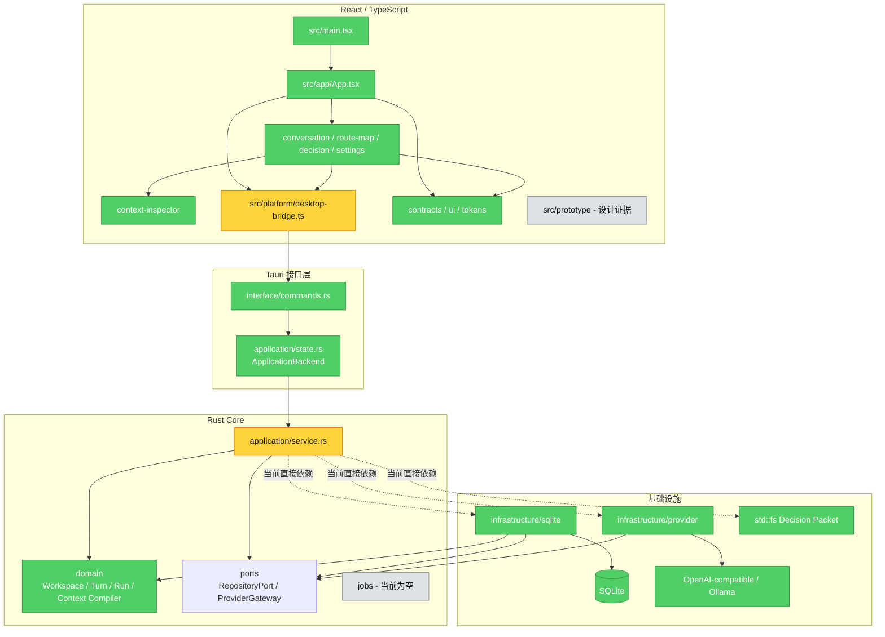

# ThoughsFlow 当前架构与实现审查

> 审查日期：2026-07-22
> 范围：当前工作区代码、未提交变更，以及现有产品/技术架构文档。`package-lock.json` 按要求排除。
> 结论：生产入口和核心闭环已经成立，但当前实现还不是完整的目标架构；存在 3 个应在发布前修复的行为/安全问题，以及 1 个明确的分层偏差。

## 1. 当前实际架构

### 前端

- `src/main.tsx` 只挂载生产 `App`，不再加载原型。
- `src/app/App.tsx` 是工作面协调器，组合 Focus、路线图、决策和 Provider 设置。
- `src/features/conversation/FocusWorkspace.tsx` 承担工作区 CRUD、路线选择、Context 预览、pin/exclude、Run 启动/重试/取消和流式 UI 更新。
- `src/platform/desktop-bridge.ts` 是唯一 Tauri 宿主入口；组件通过领域化方法调用命令，通过 `Channel<RunEvent>` 接收流事件。
- `src/shared/contracts/index.ts` 手工维护前端 DTO；目前没有从 Rust 契约自动生成。
- `src/prototype/` 与生产入口隔离，仅保留设计证据。

### Rust Core

- `interface/commands.rs` 把 Tauri command/Channel 映射到 `ApplicationBackend`。
- `application/state.rs` 定义可替换的应用边界、会话凭据存储和结构化 `AppError`。
- `application/service.rs` 实现工作区、Run 生命周期、Context 编译、路线投影、比较、判断标记、导出和 Provider 设置。
- `domain/` 保存纯 Rust 领域模型和不变量：`Turn.parent_run_id`、不可覆盖 `ModelRun`、Run 状态机、精确祖先路径、Context Manifest/Snapshot 和 canonical hash。该目录未依赖 Tauri、SQLx 或 reqwest。
- `ports/` 定义 `ProviderGateway` 和 `RepositoryPort`；Provider Port 已被应用层使用，Repository Port 尚未成为应用层真实依赖。

### 基础设施

- `infrastructure/sqlite/` 使用 SQLx、STRICT 表、外键和单事务写入 Turn/Run/Manifest/Snapshot/branch pointer；流输出按约 400ms 或 4KB checkpoint。
- `infrastructure/provider/` 复用 reqwest client，把 OpenAI-compatible SSE 与 Ollama NDJSON 归一化为 `RunEvent`。
- API Key 只在 Rust 进程内存中保存；Decision Packet 通过 `std::fs` 写入。
- `jobs/` 当前为空；FTS5、附件 Blob、备份/恢复、OS Credential Store 和持久任务队列尚未实现。

## 2. 与预期核心架构的符合度

|预期约束|当前状态|判断|
|---|---|---|
|Tauri 2 + React/TS + Rust/Tokio + SQLite|生产入口和打包链路已成立|符合|
|所有宿主调用集中到版本化 `DesktopBridge`|组件只依赖 bridge，返回包检查 `apiVersion === 1`|符合|
|Tauri Channel 传送有序归一化流事件|命令创建 Channel；Rust Provider Decoder 统一 SSE/NDJSON|符合|
|`turn.parent_run_id` 是唯一业务拓扑|schema 外键、领域图和 Context Compiler 均以精确 Run 为父级|符合|
|重试新增 Run，不覆盖旧 Run|应用用例与数据库模型均保留多个 Run|符合|
|请求前原子保存 Run + 不可变 Receipt|`persist_run_start` 单事务后才启动 Provider|符合|
|领域层不知道 Tauri/SQLx/Provider 协议|`domain/` 无这些依赖|符合|
|应用层只依赖 Domain + Ports|`application/service.rs:20-29,55-62` 直接依赖 SQLite records、`SqliteRepository`、reqwest 和具体 Provider|不符合|
|基础设施实现 Port，可被替换|Provider seam 生效；`RepositoryPort` 已定义并实现，但应用服务绕过它|部分符合|
|持久任务、搜索、备份、Blob、OS 凭据库|相关目录/能力尚未实现|未完成，不是当前 README 声称已完成的闭环|
|真实 Tauri WebView 核心旅程验证|Playwright 16 个原生旅程全部跳过，缺少外部 harness|未完成|

总体判断：核心领域方向正确，数据不变量和 Provider 流边界是当前最扎实的部分；最大架构偏差集中在 `DefaultApplicationBackend`，它同时充当用例层、DTO 映射层、基础设施组合根和文件导出器。

## 3. 已确认问题

### P1：工作区“目标”被当作模型 System Prompt

**证据**

- `src/features/conversation/FocusWorkspace.tsx:514` 创建工作区时传入 `goal: "尚未设置工作区目标"`。
- `src-tauri/src/application/service.rs:1308-1313` 把任何非空 `goal` 直接写入 `workspace.system_prompt`。
- `src-tauri/src/application/service.rs:1648-1653` 每次 Context 编译都把该字段作为 system message。
- `src-tauri/src/application/service.rs:773-781` 又把同一字段映射回前端 `goal`。
- `src-tauri/migrations/0001_core.sql:4-13` 只有 `system_prompt`，没有独立 `goal`。

**后果**

默认创建的工作区会把“尚未设置工作区目标”实际发送给模型；未来用户填写业务目标时，该描述也会被隐式提升为系统指令。工作区目标、模型行为策略和 Decision Packet 的决策问题被错误地合并为一个概念。

**修复**

在 schema、Domain、Rust DTO 和 TypeScript contract 中分离 `goal` 与 `system_prompt`。`system_prompt` 使用内部默认值或显式设置；`goal` 只作为工作区元数据和决策问题。增加迁移，并覆盖“默认工作区发送默认系统提示而不是 UI 占位文案”的测试。

### P1：Decision Packet 的 `destination` 可写任意可写路径

**证据**

- `src/platform/desktop-bridge.ts:64-67` 暴露可选 destination。
- `src-tauri/src/application/contracts.rs:350-351` 接受任意字符串路径。
- `src-tauri/src/application/service.rs:2148-2158` 对传入路径直接执行 `std::fs::write`，没有限制在 `export_root`，也没有防止覆盖已有文件。
- `src-tauri/src/lib.rs:14-35` 注册了该自定义命令；`src-tauri/build.rs` 使用默认 Tauri manifest，没有单独缩窄自定义命令范围。

**后果**

当前 UI 不传 destination，因此正常操作会写入应用数据目录；但任何在主 WebView 中执行的 JavaScript 都能调用已注册命令，把生成的 Markdown 覆盖到当前用户有权限写入的任意路径。这违反“前端不能写任意文件系统”的预期边界。

**修复**

最小安全方案是删除 destination，只允许服务端在 `export_root` 生成新文件。若必须支持“另存为”，由受控原生文件对话框返回 scoped path，并在 Rust 端拒绝覆盖或要求显式 overwrite，同时校验允许的扩展名和目标范围。

### P2：Tauri 结构化错误在前端被降级为通用文案

**证据**

- `src-tauri/src/application/state.rs:11-19` 把 `AppError` 序列化为 `{ code, message, retryable, details }`。
- Tauri 2 的 `invoke` 在 Rust command 返回 `Err(E)` 时以序列化后的 E 拒绝 Promise；它不保证是 JavaScript `Error` 实例。官方说明：[Calling Rust / Error handling](https://v2.tauri.app/develop/calling-rust)。
- `src/platform/desktop-bridge.ts:87-93` 没有规范化 reject value。
- `src/app/App.tsx:99-103`、`FocusWorkspace.tsx:232-233`、`ProviderSettings.tsx:131-133` 等路径只在 `reason instanceof Error` 时显示真实 message。
- 现有前端失败测试使用 `mockRejectedValueOnce(new Error(...))`，没有覆盖 Tauri 实际返回的结构化对象。

**后果**

数据库冲突、输入校验、Provider 连接和导出错误通常只显示“无法读取工作区视图”“发送失败”等兜底文案；`code`、`retryable` 和 details 也全部丢失。

**修复**

在 `DesktopBridge.request` 一处捕获 unknown reject value，把结构化 `AppError` 转为统一的 `DesktopBridgeError extends Error`。组件只处理这个错误类型。增加一个 mock 拒绝 `{ code, message, retryable }` 的契约测试。

## 4. 架构与维护风险

### application/service.rs 是变更半径热点

`src-tauri/src/application/service.rs` 当前约 2371 行、98 个符号，同时负责：用例编排、Context override 会话状态、Run worker、数据库 record 映射、前端 DTO 映射、路线投影、Decision Packet 格式化、Provider 连接测试和基础设施初始化。任何 schema、Provider、UI contract 或导出变化都可能修改同一文件。

建议按真实边界拆成少量深模块，而不是增加空层：

1. 先让 `DefaultApplicationBackend` 注入现有 `RepositoryPort` 和 `ProviderGateway`，把 SQLx records 移出应用层；
2. 把 Run 生命周期 worker 与 Decision Packet renderer 从 service 中移出；
3. 把 reqwest/SQLite 初始化留在 `lib.rs` 组合根；
4. 若近期不接入 Repository Port，则删除未生效的 896 行 adapter/trait 路径，避免同时维护两套持久化 API。目标架构已明确要求 Port，优先选择真正接入，而不是保留名义接口。

### 前端 Feature 组件职责过重

`FocusWorkspace.tsx` 约 806 行，混合数据加载、路由推导、流式状态机、Context override、工作区 CRUD 和完整 JSX。当前测试能覆盖主路径，但修改任一功能都需要理解整个组件。

建议先抽取可独立验证的 `useRunSession`（启动/重试/取消/事件归并）和 `useWorkspace`（加载/CRUD/选择）两个 hook；不要按视觉小块机械拆出大量薄组件。

### 手工 DTO 存在跨语言漂移风险

Rust `application/contracts.rs` 与 TypeScript `shared/contracts/index.ts` 手工重复字段、枚举和 serde 命名。当前 `tsc` 只能验证前端内部一致性，不能发现 Rust/TS contract 漂移。应从 Rust schema 生成 TypeScript，或至少增加一个序列化 fixture contract test。

### 首包已出现体积警告

生产构建生成单个 583.42 kB JS chunk（gzip 183.09 kB），超过 Vite 500 kB 警告阈值。`App.tsx` 当前同步导入路线图、决策和设置工作面；可以仅对这些次级工作面使用 `React.lazy`/dynamic import。不要只提高 warning 阈值。

## 5. 尚未完成但不应误判为当前回归

以下是目标架构的后续能力，当前代码和 README“当前限制”并未声称已经完成：

- FTS5 搜索与搜索 UI；
- SQLite Online Backup、完整备份/恢复和迁移前快照；
- 附件、内容寻址 Blob、解析 worker；
- 持久 job 队列；
- OS Credential Store；
- Windows/Linux 实机打包与 WebView QA；
- 可驱动 Tauri WebView 的原生 E2E harness。

优先级建议：先修复 3 个已确认问题，再补原生 E2E；随后修复 Repository Port 分层；搜索、备份、Blob 和持久任务按产品里程碑进入，不提前搭空架子。

## 6. 未提交变更审查结论

两组 reviewer 分别检查了以下文件的 staged 与 unstaged diff：

- `.gitignore`、`README.md`；
- `index.html`、`package.json`、`src/main.tsx`。

入口切换、依赖/脚本、HTML metadata 和 ignore 规则没有发现直接回归。补充的架构交叉检查发现：`README.md:88-92` 展示的是目标依赖方向，不是当前完全实现的方向；当前 `Application Service` 仍直接依赖 SQLite/reqwest/Tauri runtime。README 应明确标注“目标分层”，或在合并前真正接入 Repository Port。

## 7. 验证记录

- `npm run check`：6 个 Vitest 文件、18 个测试通过；TypeScript 检查和 Vite 生产构建通过。
- LSP workspace diagnostics：无 TypeScript 问题。
- `cargo test --all-targets`：45 个测试通过。
- `cargo clippy --all-targets -- -D warnings`：通过。
- `cargo fmt --all -- --check`：通过。
- `CI=true npm run tauri -- build`：成功生成 `ThoughsFlow.app` 和 `ThoughsFlow_0.1.0_aarch64.dmg`。
- `npm run test:e2e`：16 个测试全部 skipped；当前没有原生 Tauri WebView harness，因此不能把它们计为通过。

## 8. 最终判断

核心闭环已经具备可运行、可测试、可打包的实现，精确 parent Run、不可变 Receipt、事务先于 Provider I/O、SSE/NDJSON 归一化和取消/checkpoint 方向均符合预期。当前不能判定为“目标架构已完成”或“可直接发布”：工作区 goal/system prompt 混用、任意导出路径和 Tauri 错误丢失需要先修；Repository Port 边界和原生 E2E 是下一阶段的架构与发布门槛。
