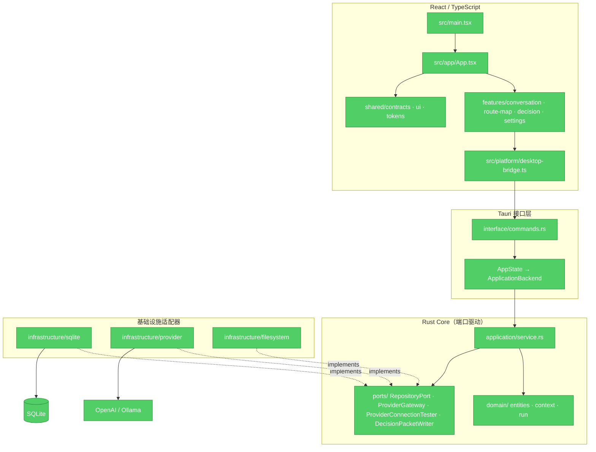

# ThoughtsFlow 代码实现审查（修正版）

> 历史报告：以下结论对应 2026-07-22，部分问题已经修复。2026-09-22 的当前实现核查与优化方案见 [原始构想达成度](docs/VISION_ALIGNMENT.md) 和 [架构优化](docs/ARCHITECTURE_EVOLUTION.md)，请勿将历史行号和建议直接当作当前缺陷。

> 审查日期：2026-07-22
> 范围：当前工作区全部生产代码，对照 `README.md`、`PRODUCT_BLUEPRINT.md` 和 `跨平台技术路线与产品技术架构调研.md` 中描述的预期架构。

> **重要更正**：本文件的第一版基于 codegraph 缓存数据，得出了多个错误结论。经逐行验证当前磁盘源码后，以下结论已全部修正。错误的 P1 发现（goal/system_prompt 混用、export destination 任意写入、应用层直接依赖 SqliteRepository）均不成立。

## 1. 当前架构与文档符合度



### 符合预期的部分

| 预期约束 | 当前实现 | 判断 |
|---|---|---|
| 所有宿主调用集中到版本化 `DesktopBridge` | `desktop-bridge.ts` 检查 `apiVersion === 1`；组件不直接调用 Tauri API | ✓ |
| 应用层通过 Port 依赖基础设施 | `DefaultApplicationBackend` 持有 `Arc<dyn RepositoryPort>`、`Arc<dyn ProviderGateway>`、`Arc<dyn ProviderConnectionTester>`、`Arc<dyn DecisionPacketWriter>`（`service.rs:47-55`） | ✓ |
| 组合根在 `lib.rs`，注入具体实现 | `lib.rs:52-71` 创建 `SqliteRepository`、`ReqwestProviderGateway`、`LocalDecisionPacketWriter` 并注入 | ✓ |
| 领域层无 Tauri/SQLx/reqwest 依赖 | `domain/` 目录 grep 无匹配 | ✓ |
| `turn.parent_run_id` 是唯一业务拓扑 | schema 外键、领域图、Context Compiler 均以精确 Run 为父级 | ✓ |
| 重试新增 Run，不覆盖旧 Run | `retry_run_impl` 传 `new_turn_id: None`，复用 Turn，创建新 Run 和 Snapshot | ✓ |
| 请求前原子保存 Run + 不可变 Receipt | `persist_run_start` 单事务写 Turn/Run/Manifest/Snapshot/BranchPointer | ✓ |
| 发送前 Context hash 复核 | `ContextCompiler::compile` 比对 `expected_preview_hash`（`context.rs:395-400`） | ✓ |
| Provider 安全策略：HTTPS 或 loopback HTTP | `security.rs:15-28` 校验 scheme 和 host；URL 不允许嵌入凭据 | ✓ |
| API Key 仅进程内存，退出清零 | `SessionCredentialStore` 用 `Vec<u8>` + `fill(0)` on replace/drop；Debug redacted | ✓ |
| Decision Packet 写入受控 | `LocalDecisionPacketWriter` 忽略外部路径，生成 UUID 文件名，`create_new(true)` 防覆盖，有路径逃逸测试 | ✓ |
| 工作区 goal 与 system_prompt 分离 | `0002_workspace_goal.sql` 添加独立 `goal` 列；创建时 `system_prompt` 空则用 `DEFAULT_SYSTEM_PROMPT` | ✓ |
| SSE 与 NDJSON 归一化为统一事件 | `OpenAiSseDecoder` 和 `OllamaNdjsonDecoder` 输出同一 `RunEvent` 枚举 | ✓ |
| Run 状态机有乐观并发守卫 | `mark_run_connecting`/`mark_run_streaming`/`checkpoint_run`/`finish_run` 均有 `WHERE status = ?` 守卫 | ✓ |
| 崩溃恢复保留部分输出 | `recover_interrupted_runs` 将 `connecting`/`streaming` → `interrupted`，保留已 checkpoint 的 output | ✓ |
| AI 输出渲染安全 | `SafeMarkdown` 使用 `skipHtml`，CSP 禁止 inline script，`react-markdown` 不执行 HTML | ✓ |

**总体判断：当前实现已经达到了文档描述的目标分层。** 应用层通过四个 Port trait 访问所有基础设施，组合根在 `lib.rs::run()`，领域层零基础设施依赖。

## 2. 已确认问题

### P2：Tauri 结构化错误在前端被降级为通用文案

**证据**

- `src-tauri/src/application/state.rs:11-19`：`AppError` 序列化为 `{ code, message, retryable, details }`。
- Tauri 2 的 `invoke` 在 Rust command 返回 `Err(E)` 时，以序列化后的 `E` 值 reject Promise。对于 derive Serialize 的 struct，reject value 是普通 JS 对象，**不是** `Error` 实例。参见 [Tauri: Calling Rust → Error handling](https://v2.tauri.app/develop/calling-rust)。
- `src/platform/desktop-bridge.ts:87-93`：`request` 函数直接 `await invoke(...)`，不做 reject value 规范化。
- `src/features/conversation/FocusWorkspace.tsx:232`、`src/app/App.tsx:103`、`src/features/settings/ProviderSettings.tsx:133` 等所有 catch 块均使用 `reason instanceof Error ? reason.message : "兜底文案"`。
- 前端测试（如 `App.test.tsx:226`）用 `mockRejectedValueOnce(new Error(...))` 模拟拒绝，未覆盖 Tauri 真实返回的普通对象。

**后果**

数据库冲突（如 preview hash mismatch）、Provider 连接失败、输入校验错误等场景，用户看到的不是 Rust 返回的 `{ code, message }` 中的 `message`，而是 `"发送失败"` / `"无法读取工作区视图"` 等无信息量的兜底文案。`code` 和 `retryable` 也完全丢失。

**修复**

在 `DesktopBridge.request` 一处统一捕获 reject value：

```ts
const request = async <T>(command: string, args?: Record<string, unknown>) => {
  try {
    const response = await invoke<ApiEnvelope<T>>(command, args);
    if (response.apiVersion !== 1) {
      throw new Error(`Unsupported DesktopBridge API version: ${response.apiVersion}`);
    }
    return response.data;
  } catch (reason: unknown) {
    if (reason && typeof reason === "object" && "message" in reason) {
      const error = new Error(String((reason as { message: unknown }).message));
      Object.assign(error, reason);
      throw error;
    }
    throw new Error(typeof reason === "string" ? reason : "Unknown bridge error");
  }
};
```

然后增加一个 mock 拒绝 `{ code, message, retryable }` 的契约测试，替换现有 `new Error(...)` 的 mock。

### P3：README 崩溃恢复范围描述与实现不一致

**证据**

- `README.md:59`："应用启动时，数据库中的 `queued`、`connecting` 或 `streaming` Run 会变为 `interrupted`。"
- `src-tauri/src/infrastructure/sqlite/repository.rs:461-465`：`WHERE status IN ('connecting', 'streaming')` — **不含** `queued`。
- 代码注释（`repository.rs:459-460`）明确："Queued Runs were never sent and remain retryable after restart."

**后果**

文档误导：用户以为 `queued` 状态的 Run 在重启后变为 `interrupted`，但实际 `queued` Run 保持原状（从未发送，可安全重试）。代码行为更合理，文档不准确。

**修复**

更新 `README.md:59` 为：

> 应用启动时，数据库中的 `connecting` 或 `streaming` Run 会变为 `interrupted`，已有部分输出不会丢失。`queued` 状态的 Run 从未发送请求，保持可重试。

## 3. 值得关注但不阻塞的实现特征

### `application/service.rs` 体量较大

约 2162 行、90+ 个符号。涵盖工作区 CRUD、Run 生命周期编排、Context override 会话状态、路线投影、决策标记、导出格式化、Provider 设置和连接测试。当前函数边界清晰（每个用例是独立 `async fn`），但文件本身是变更半径热点。未来可按用例域拆分为 `workspace_service`、`run_service`、`decision_service` 等深模块。

### Rust/TypeScript DTO 手工维护

`src-tauri/src/application/contracts.rs` 和 `src/shared/contracts/index.ts` 手工重复字段、枚举值和 serde camelCase 命名。`tsc --noEmit` 只验证前端内部一致性，无法发现 Rust 端新增字段后 TS 端漏改。建议引入 `ts-rs` 或 `specta` 从 Rust 类型生成 TypeScript，或至少增加一个序列化 fixture 对比测试。

### 生产 JS 单 chunk 超过 500KB

`dist/assets/index-CaQGTyWy.js` 为 583.42 kB（gzip 183.09 kB）。`App.tsx` 同步导入 Focus、RouteMap、Decision、Settings 四个工作面。可对次级工作面（路线图、决策、设置）使用 `React.lazy` + dynamic import 做路由级代码分割。

### `open_workspace_impl` 存在 N+1 查询

`service.rs:1387-1409` 对每个 Turn 单独调用 `list_runs_for_turn`。对于 50+ Turn 的工作区产生 50+ 次查询。SQLite 本地查询仍快（每次 <1ms），且已有 `load_conversation_graph` 方法能一次性加载全部 Turn/Run/ContentBlock。可在 `open_workspace_impl` 中复用该方法再投影为 `WorkspaceDetail`。

### `save_provider_profile_impl` 未在保存时校验 base_url

`service.rs:1944-1976` 直接将 `input.base_url` 存入数据库，不调用 `validate_base_url`。安全策略在连接测试（`client.rs:185`）和实际请求（`client.rs:51`）时才生效。无效 URL 的 Profile 可以保存成功，但在首次使用时会安全失败。前端（`ProviderSettings.test.tsx:47`）已有保存前校验。建议在 Rust 端也加一层防御。

### `jobs/` 模块为空

目标架构描述了"持久任务调度器"用于附件解析、FTS 重建、缩略图和备份。当前 `src-tauri/src/jobs/mod.rs` 为空模块。这符合"不在需要前建立空架子"的原则，README "当前限制" 也已声明这些能力未实现。

### Playwright E2E 全部跳过

`npm run test:e2e` 运行 16 个测试，全部 `skipped`。`README.md:74-80` 说明需要 `THOUGHSFLOW_E2E_NATIVE=1` 和外部 Tauri WebDriver harness。当前没有可驱动 Tauri WebView 的 harness，因此核心桌面旅程（创建工作区、流式请求、分支、比较、导出）没有自动化验证。

## 4. 前端架构审查

### 事件缓冲模式正确

`FocusWorkspace.tsx:355-368` 的 `bufferedRunEvents` 在 `createTurnAndStartRun` 的 invoke 返回前缓冲流事件，返回后 `release()` 按序回放。这正确处理了"RunStarted 事件可能在 invoke resolve 之前到达"的竞态。

### 前端乐观更新回滚有并发隐患

`FocusWorkspace.tsx:473-493` 的 `toggleOverride` 乐观更新 pin/exclude 状态，失败时回滚到闭包捕获的旧值。如果用户快速连续切换两个 item，第一个失败会回滚到第一个切换前的状态，丢失第二个的乐观更新。这是 UX 层面的小问题，不影响数据正确性（后端 override 是真相源）。

### `consumeRunEvent` 静默忽略两个事件类型

`FocusWorkspace.tsx:297-353` 处理了 `run-started`、`text-delta`、`reasoning-delta`、`usage-updated`、`run-completed`、`run-failed`、`run-cancelled`、`persistence-failed`。`checkpoint-saved` 和 `provider-metadata` 事件被接收但忽略。这两个是诊断/信息性事件，忽略不影响功能。

## 5. 安全审查

| 检查项 | 状态 | 证据 |
|---|---|---|
| Provider URL 安全策略 | ✓ | `security.rs:7-35`：拒绝非 HTTP(S)、拒绝 URL 内凭据、远程仅 HTTPS、loopback 允许 HTTP |
| API Key 内存隔离 | ✓ | `credentials.rs`：`Vec<u8>` 存储，replace/remove/drop 时 `fill(0)`，Debug redacted，不持久化 |
| CSP 策略 | ✓ | `tauri.conf.json:27`：`script-src 'self'`；生产 CSP 不含 `unsafe-eval` 或 `unsafe-inline`（style 除外） |
| AI 输出 XSS 防护 | ✓ | `SafeMarkdown`：`skipHtml` + `react-markdown`；不渲染原始 HTML |
| 自定义命令权限 | ⚠ | `build.rs` 使用默认 Tauri manifest，未通过 `AppManifest::commands` 缩窄自定义命令范围。所有 19 个命令对主窗口可调用。当前 CSP 和 `skipHtml` 使 WebView 可信，但缺少纵深防御 |
| Decision Packet 路径隔离 | ✓ | `filesystem.rs:22-46`：服务端生成路径，`create_new(true)`，有路径逃逸测试 |
| Tauri Channel 数据 | ✓ | RunEvent 通过 Channel 传送，不接受前端回传的任意命令参数 |

## 6. 验证记录

| 检查 | 结果 |
|---|---|
| `npm run check`（vitest + tsc + vite build） | 18 测试通过，TypeScript 无错误，生产构建成功 |
| LSP workspace diagnostics | 无 TypeScript 问题 |
| `cargo test --all-targets` | 45 测试通过 |
| `cargo clippy --all-targets -- -D warnings` | 通过 |
| `cargo fmt --all -- --check` | 通过 |
| `CI=true npm run tauri -- build` | 成功生成 `.app` 和 `.dmg` |
| `npm run test:e2e` | 16 测试全部 skipped（无原生 harness） |

## 7. 最终判断

**当前代码实现与文档描述的核心架构高度一致。** 端口驱动的分层、精确 parent Run 拓扑、不可变 Context Receipt、Provider 安全策略和 Run 状态机守卫均已正确实现。唯一确认的功能性 bug 是 P2 的 Tauri 错误处理——前端无法显示 Rust 返回的结构化错误信息。P3 的 README 恢复范围描述需要修正。其余为可接受的工程债（DTO 手工维护、bundle 体积、N+1 查询、E2E 缺失），不影响当前 macOS 闭环的正确性。
