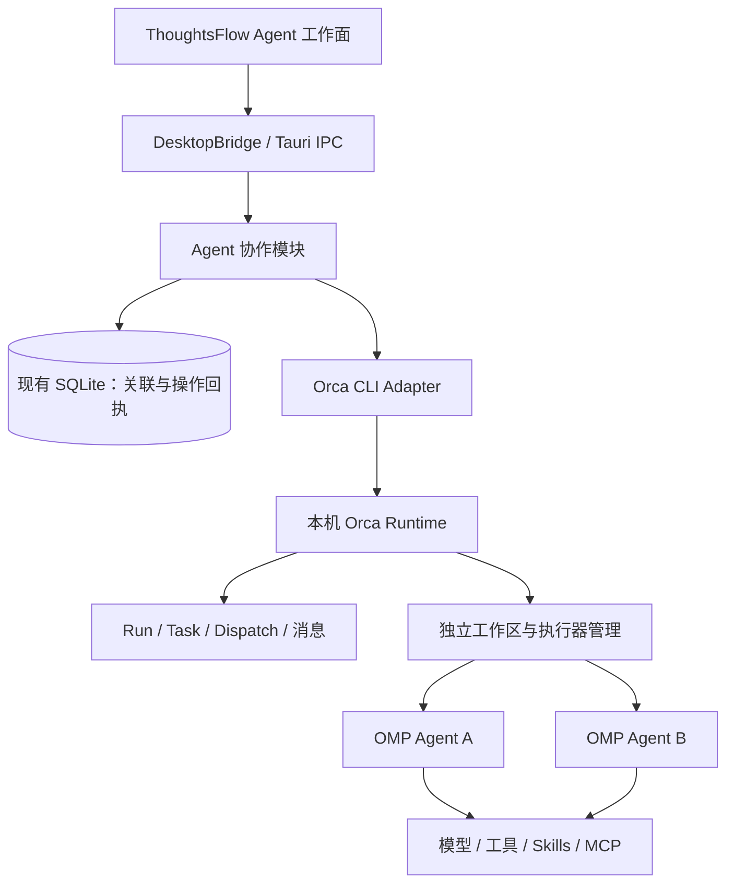

# ThoughtsFlow × Orca × OMP 架构与实施

本方案依据 `ask-matt` 路由的设计原则：先澄清关键产品选择，建立领域词汇，以少量接口承载复杂行为，再按可独立验证的纵向功能实施。用户已确认接入当前 ThoughtsFlow，并允许依赖 Orca 运行时。采用的取舍见 [ADR 0001](adr/0001-orca-runtime-omp-workers.md)。

## 产品闭环

用户在 ThoughtsFlow 选择已经登记到 Orca 的本地项目，创建协作目标，将目标拆成有明确范围和验收条件的任务。多个 OMP 执行器分别在独立工作区执行；用户在同一面板查看任务结果、运行状态和输出，回复执行器提问，并释放已结束的执行器。代码是否合并仍由用户决定。

初版采用人工拆分任务。它先解决真实的任务执行闭环；自然语言自动拆解、依赖调度和自动评审属于后续纵向功能，不以额外模型调用掩盖底层连接问题。

## 职责划分

| 模块 | 权威数据与行为 | 对外承诺 |
| --- | --- | --- |
| ThoughtsFlow 对话与决策 | Turn、Model Run、Context Receipt、Decision Mark | 继续保持精确回答版本和不可变 Receipt |
| Agent 协作模块 | Mission 关联、用户发起的操作及其回执 | 不重复启动未知结果的操作，不把外部进程状态当作任务结果 |
| Orca Runtime | Run、Task、Dispatch、执行器、工作区、消息 | 使用真实生命周期与身份信息 |
| OMP | Agent 循环、模型设置、工具、会话、内部子代理 | 由 Orca 以原生 `omp` Agent 启动 |

OMP 内部的子代理属于一个执行器的内部行为；用户显式创建的并行任务才属于工作台的任务列表。两层任务不能混为一谈。

## 核心 Interface

前端只经 DesktopBridge 调用运行环境、Mission、任务启动、快照、提问回复、输出读取、执行器释放和重新连接。它不能拼接任意 CLI 命令，也不持有 OMP 或现有 Provider 的凭据。

Rust 的 Orca Adapter 负责固定可执行程序的发现、独立 argv、JSON 解码、超时、输出上限和身份环境隔离。业务模块负责关联、操作幂等、任务归属与允许的状态转换。测试通过可替换的 CLI 执行 Interface 注入真实形状的响应，并使用真实 SQLite 验证持久化行为。

## 数据与状态

- **Mission** 对应一个 ThoughtsFlow 工作区中的协作目标，绑定一个 Orca Run 和专用协调者。选择的代码项目与 ThoughtsFlow 对话工作区是不同概念。
- **Task** 是可验收工作；**Dispatch** 是该任务的一次执行尝试。重试不覆盖旧执行结果。
- **Operation** 是用户的一次控制请求。先保存请求 ID，再进行外部调用，最后保存回执。状态为 pending、succeeded、failed 或 unknown。
- **任务结果** 与 **执行器存活** 分开显示。任务完成后执行器可能仍然存活；执行器退出不能证明任务成功。

操作成功仅表示控制命令已被接受或完成，不能显示成“任务完成”。任务结果以 Orca 的持久化结果为准。未确认结果、连接丢失、身份失效均保留原有任务与回执，不自动启动替代执行器。

## 身份与恢复

每个 Mission 创建一个专属空闲 shell 作为协调者身份载体，不额外启动协调 AI。通过 `run-create --from <handle>` 绑定 Run。不能使用用户其他 Agent 的终端，也不能让多个 Mission 争用同一个协调者 pane。

适配器不继承调用者的 Orca Agent 身份和远程目标环境变量；本版只连接本机。运行时或句柄失效时显示断开，用户显式重新连接后，创建专用新终端并执行 `run-use`。重新连接保留原 Task/Dispatch，不重新派发任务，也不将未知启动回执改成成功。

首版邮箱采用只读 `check --peek`；不会隐式消费 FIFO delivery 或自动 ACK 用户尚未处理的消息。后续后台协调器若需要消费邮箱，必须引入单一消费者和完整批次确认。

Orca 当前只读邮箱每次最多显示 100 条未读消息，且不提供该模式的分页游标。达到上限后工作台显示警告并暂停新增任务，已有问题仍可回复、已结束执行器仍可释放；需要在 Orca 处理邮箱后继续。不会把容量不足伪装成“暂无新消息”。

## 文件、模型与交互

新任务由 Orca 从项目默认 base 创建独立工作区，不复制当前未提交改动，并跳过隐式仓库 setup hook；工作区隔离不是操作系统沙箱。OMP 沿用本机已有模型、凭据、工具和审批配置。任务说明由用户显式提交，现有对话历史和 Provider 会话凭据不自动传给执行器。

Orca 1.4.206 的 worker-start 支持 `--agent omp`，但其 `--model` 参数支持范围不包括 OMP。工作台不会假装支持无效的模型覆盖。停止运行中任务、OMP 工具审批继续通过 Orca/OMP 的原生交互处理，工作台里的“回复提问”指的是协调消息，不冒充工具审批界面。

## 纵向实施顺序

| 顺序 | 交付 | 依赖 | 验收 |
| --- | --- | --- | --- |
| 1 | 环境检测与 Agent 工作面 | 无 | 没装 Orca、没启动、可连接、OMP 不可用均显示真实状态 |
| 2 | Mission 创建与恢复 | 1 | 项目选择、专属身份、持久化、应用重启后可重开，失败阶段有回执 |
| 3 | OMP 并行任务与输出 | 2 | 每次显式启动独立 Dispatch/工作区，状态和输出可查，未知调用不自动重放 |
| 4 | 提问回复与执行器释放 | 3 | 仅操作本 Mission 的消息和执行器，释放要求已结算，保留输出 |
| 5 | 后续：依赖图与自动拆解 | 1–4 | 真实成功才解锁下游；计划经用户审阅后执行；并发与预算可限制 |
| 6 | 后续：结果进入决策闭环 | 1–4 | 显式采纳 Agent 证据并保存来源；不伪造为现有 Model Run Receipt |

本次实现范围为 1–4。5、6 需要新的产品行为与数据契约，单独实施。

## 验证方式

1. 前端组件验证用户操作、重复点击、未知回执、断连和页面切换时的过期响应。
2. Rust 用结构化 Orca fixture 验证参数、任务归属、幂等、未知结果和重新连接；SQLite 使用现有数据库连接池和迁移。
3. 集成层验证 Tauri 命令注册、camelCase 契约、编译与现有回归。
4. 实际运行环境另行记录无模型控制链路与真实 OMP 任务结果；fixture 通过不能替代真实模型执行成功。

## 核查依据

2026-09-22 本机核查 Orca 1.4.206、OMP 18.2.8。Orca 的版本匹配指南来自 `orca skills get orca-cli` 和 `orca skills get orchestration`，命令参数来自本机 CLI help，响应形状来自实际调用与随应用发布的 CLI 源码。

已实测运行时启动、专用终端创建、`run-create --from`、指定 Run 的 worker/task 列表与只读邮箱。此阶段没有真实 OMP 模型任务完成证据。

同日后续用户授权的真实 OMP 短任务已经完成文件生成、独立校验、结果回传和释放，见 [LIVE_AGENT_QA_RESULTS.md](LIVE_AGENT_QA_RESULTS.md)。它不代表真实多 Agent 并发或全部模型配置均已验证。

OMP 的底层能力另参考 [v18.2.8 RPC 文档](https://github.com/can1357/oh-my-pi/blob/v18.2.8/docs/rpc.md)。本方案让 Orca 拥有 OMP 连接，不在 ThoughtsFlow 同时启动第二条 RPC 控制链。
