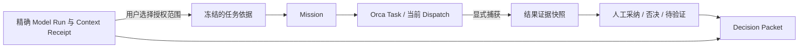

# 架构优化：保持推演来源，连接执行证据

评估日期：2026-09-22。产品达成度见 [VISION_ALIGNMENT.md](VISION_ALIGNMENT.md)，现有 Orca 接入取舍见 [ADR 0001](adr/0001-orca-runtime-omp-workers.md)。本文件区分本轮实现与后续设计，避免把设计图算成功能完成。

## 判断与保留项

目前最有价值的内核已经成立：精确 Model Run 分支、不可变 Context Receipt、本地持久化、路线比较、人工判断与 Decision Packet。完整全文搜索、可恢复数据包和真实用户验证尚未完成；Agent 执行也还没有返回决策证据链。

保留 Tauri / React / Rust / SQLite、单一业务拓扑 `Turn.parent_run_id`、请求前原子冻结 Receipt、显式上下文调整和 Orca 拥有执行生命周期的选择。现有 Provider / Repository / Writer 的 Interface 有真实替代实现和测试价值，不需要再加一层通用框架。

不以文件长度判断架构好坏。例如评估前 `application/service.rs` 有 6,443 行，但从第 4,623 行起是测试；把整个文件称为 6,443 行业务巨类并机械拆分会误导优先级。旧架构报告提到的 N+1 查询、同步导入所有次级工作面等也需要按当前源码核验，不能照旧重复整改。

## 本轮优化范围

以下改造已落实到代码；不新增框架，不修改现有 IPC 契约或数据库 schema。验证结果见 [ARCHITECTURE_QA_RESULTS.md](ARCHITECTURE_QA_RESULTS.md)。

### 1. 工作区交互 module：异步结果必须有明确归属

原先打开工作区、刷新树、发送回执和流事件分别写入 React 当前状态。用户从 A 切到 B 后，A 的慢响应仍可能改变 B 的标题、回答、草稿、错误或活动 Context。后端 Receipt 隔离不能替代前端正确呈现来源。

目标是用统一的工作区会话身份与请求代次管理异步结果：

- 打开较新的工作区使旧打开请求失去提交资格。
- 已发出的模型运行继续由后端管理；切换界面不意味着取消任务。
- 旧运行的回执与流事件不能提交到新的工作区会话。
- 同工作区的较旧刷新也不能覆盖较新的权威状态。
- 失败的切换不能向应用壳报告一个从未成功打开的工作区。

测试使用 FocusWorkspace 的公开 Interface 与延迟返回的 DesktopBridge，直接验证用户可见的标题、回答、Context 与草稿，不为每个内部 setter 创建测试。

### 2. Agent Task 投影 module：选择确切的当前 Dispatch

一个 Task 可以有多个 Dispatch。原先按 Task ID 取列表中的第一个 worker，会让数组顺序决定当前执行尝试。活动任务以 Task 的权威 `dispatch_id` 关联；找不到或冲突时显示未确认，不能猜测历史 worker。

真实 Orca 的 `task-list` 只连接活动 Dispatch，任务结算后该字段变为 null。因此，已完成或失败的任务仅在存在唯一关联 worker、其已结算且结果与任务一致时展示该结果。存在多次执行歧义时仍不猜测顺序；完整尝试历史是单独的后续能力。

当前任务卡、输出入口和释放资格必须由同一投影得出。明确指定历史 Dispatch 的只读输出查询仍可保留；历史不能冒充当前执行。

### 3. Mission 控制 module：验证结果后原子提交本地状态

原先通用执行函数先把 Operation 记为 succeeded，重连调用方随后才校验返回的 Run，并分别保存绑定与 Mission。这会造成“首次报错、同 ID 重放成功”，或回执与本地绑定不一致。

目标顺序为：

```text
验证请求与归属
    → SQLite 保存 pending 和请求身份
    → Orca 执行一个外部动作
    → 按该动作核验返回身份与完成证据
    → SQLite 事务提交 Operation + 本阶段 Mission / Binding
```

这是本地事务，不是跨 Orca 的分布式事务。调用超时、回执缺失或身份不符仍保留 unknown，原始回执不得丢弃，也不得用新操作 ID 自动重启执行器。终端创建与 Run 创建分别是一个外部阶段，各自保存证据。

### 4. 并发归属跟随 Mission

原先所有协作共用一把锁，启动 A 的执行器时，B 的查看、回复和释放也会等待。优化后同一 Mission 内串行处理以保护 journal 和绑定，不同 Mission 独立推进。SQLite 保持现有单连接池；不因为慢外部 I/O 就改数据库模式或增加后台调度系统。

验证使用可控制的异步门闩：挂起 A 的启动，证明 B 的操作能完成，同时 A 的重复请求不会启动第二个执行器。避免依赖机器速度的微基准断言。

### 5. 应用壳拥有视口高度

真实 WKWebView 验收发现 Focus 自行占用 `100dvh`，再叠加顶栏，会将发送按钮推出窗口。实际按钮未禁用，但中心点位于可见区域外。应用壳现在用网格分配顶栏和剩余空间，Focus 填充剩余高度，其余长工作面在内容区滚动；工作面不再自行假定拥有完整窗口高度。保留原生点击断言，并在失败时输出按钮几何信息辅助诊断。

## 后续目标架构：依据与结果都有身份



图中“冻结的任务依据”“结果证据快照”“证据判断”是后续设计，当前没有对应完整产品功能。本轮不自动搬运任何现有对话给 OMP。

| Module | 权威内容 | 不应承担的职责 |
| --- | --- | --- |
| 推演与 Context | Turn / Model Run / Receipt / Branch / Checkpoint | 推断 Orca 执行器状态 |
| Mission 控制 | 用户意图、外部身份关联、Operation journal | 复制 Orca 调度器或把启动确认当成果 |
| Orca adapter | 本机协议、回执解码、能力与身份检查 | 决定用户应采纳哪份结论 |
| 结果证据（待实现） | 显式捕获的内容、来源、时间、完整性和 hash | 持有能重放任务的运行时凭证 |
| 决策与导出 | 人的判断及被引用的推演与证据 | 静默把 Agent 自述认定为验证成功 |

### 任务依据的数据选择

从精确 Model Run 发起 Mission 时，应让用户审阅要交给执行器的内容，而不是仅传一个可变 cursor。最小记录包含源工作区、源 Model Run、引用的 Receipt hash、用户选定内容、内容 hash 和冻结时间。引用历史提供出处；冻结文本说明实际授权传出的内容。

### 结果证据的数据选择

新增专门的结果证据记录，关联本地 Mission 和外部 Task / Dispatch，保存捕获文本、捕获时间、内容 hash、观察到的结果以及 complete / partial / unknown 完整性。它不是 Model Run，不应为其生成虚假的 Provider Receipt。

初版证据不需要通用多态实体图。保留现有针对 Model Run 的 Decision Mark；为结果证据增加独立判断记录，再在 Decision Packet 中共同呈现。等出现真实的第三种证据来源时，再评估统一接口是否有价值。

### 可恢复数据与搜索

全文搜索应从持久化 Prompt / 回答全文建立本地索引，结果定位到精确 Model Run；不能把 Context Tree 预览字符串筛选当成全文搜索。中文召回策略和基准需要单独验证。

可恢复数据包需要版本、引用完整性校验和导入事务；在全新数据库恢复后必须保留路线、回答、决定和 Receipt。外部 Agent 状态导入后只作为历史证据，不取得活动协调者身份，不自动派发任务。导出元数据不包含凭据、运行时授权或可执行恢复指令，用户选定的内容仍需由用户审阅。

## 分阶段验收

| 阶段 | 可独立交付的结果 | 完成证据 |
| --- | --- | --- |
| 本轮：状态与身份一致性 | 切换工作区不串状态；当前 Dispatch 准确；回执与绑定一致；不同 Mission 不互相阻塞 | 延迟响应 / 多尝试 / 事务失败 / 重放 / 并发回归，加原生旅程 |
| 下一步：原始 P0 数据能力 | 找得到旧结论，数据可导出并在新库恢复 | 长回答中文命中与精确跳转；导出→全新库导入的引用与 hash 一致性 |
| 下一步：研究与执行证据闭环 | 从准确路线派发任务，显式捕获并判断证据，导出包含来源 | 从 UI 走一条完整旅程，另记录真实 OMP 模型运行证据 |
| 并行：用户验证 | 证明用户在自己的第二个任务中主动复用 | 原计划中的真实任务访谈、跨天找回、误入路线与重复采用记录 |

本轮的代码改造不等于后续功能已完成，也不替代真实用户研究。实现与回归结果会单独记录在本轮验证记录中。
