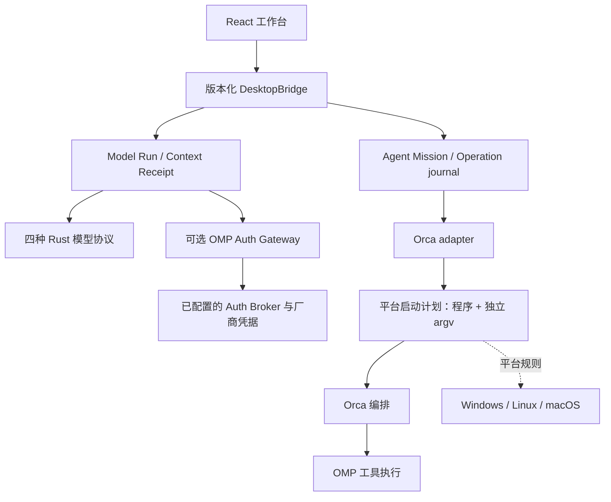

# 跨平台、模型接入与性能路线

2026-09-26。本轮沿用 `ask-matt` 的分阶段方法，把跨平台运行、模型连接、运行时编排分成可独立验证的纵向改动。用户已确认先配置三平台 CI，后续接入运行；当前仓库没有 Git remote，不创建或推送远端仓库。

## 架构选择

业务模型和 SQLite 不按操作系统分叉。模型请求保持精确的上下文编译与 Receipt；Agent 生命周期继续归 Orca。新增厂商优先复用已有协议；特别的 OAuth、AWS 签名、Vertex ADC 等不能冒充通用 API Key 支持。OMP Gateway 提供扩展路线，但其 broker 前置必须明确。

## 功能切片与状态

| 功能切片 | 本轮实现 | 验证与后续 |
| --- | --- | --- |
| 跨平台运行时启动 | 原生程序发现、固定 Node 脚本入口、Windows argv 上限、隐藏控制台、身份环境隔离 | macOS 测试及条件分支测试；Win/Linux 等对应 runner |
| 跨平台工具链 | Node 24、无 shell 启动脚本、三 OS build/unit CI、手动 GUI fixture CI | 本地验证；没有远端 CI 成功记录 |
| 广泛模型连接 | 18 个内建模板，OMP Gateway 和 10 个新增厂商/地区配置；Anthropic 实时有界分页 | 协议 fixture；各供应商真实账号及网关 broker 仍需分别配置验证 |
| 性能 | 独立 Agent 查询并行；大目录最多渲染 100 个匹配候选 | 固定延迟基准与公开 UI 行为测试；不夸大为真实网络加速 |
| 上游跟踪 | 固定来源与能力矩阵、每周检查、按功能提交 | 只对有依据且通过测试的兼容能力实施 |

## Interface 与验收

运行时进程 Interface 接受受控的程序和独立 argv。显式路径错误不切换到另一个运行时；Windows 不执行 `.cmd/.bat`。脚本入口只能作为显式配置，交给固定 Node 程序；模型任务正文不能成为 shell 命令。超长 Windows 参数在任何子进程启动前明确失败。

模型目录 Interface 只读元数据，不能发送工作区上下文；响应有时间、字节、条数和分页预算，跨页始终使用同一已验证 endpoint。缺少目录接口的模板允许手填模型 ID，但不伪发探测请求。未知模型能力保持 unknown，不凭名称猜测。

Agent 快照仍先验证连接和绑定，再并行读取彼此独立的数据。任何一项失败都不能发布部分结果，也不缓存执行器存活或权限结论。跨 Mission 的并发与同 Mission 的串行保护继续有效。

## 后续明确事项

1. 接入用户指定的 Git remote，在 Windows、Ubuntu 与 macOS runner 跑当前 CI，保留 commit、平台与运行链接；之后才宣称对应平台可运行。
2. 增加发布级的 Windows 签名、macOS 公证、Linux 发行版与 CPU 架构验收。当前无安装包发布承诺。
3. 需要无需 broker 的完整 OMP SDK 接入时，单独设计版本锁定的模型 sidecar，处理 Bun/原生库、OAuth、凭据存储与第二跳 Receipt，不能偷偷替换当前请求语义。
4. 原始产品的全文搜索、可恢复数据包，以及 Agent 结果进入决策证据链继续见 [架构路线](ARCHITECTURE_EVOLUTION.md)，本轮不将其记为完成。

详见 [跨平台说明](CROSS_PLATFORM.md)、[模型连接](MODEL_CONNECTIONS.md)、[性能证据](PERFORMANCE_20260926.md) 与 [上游跟踪](upstream/README.md)。
