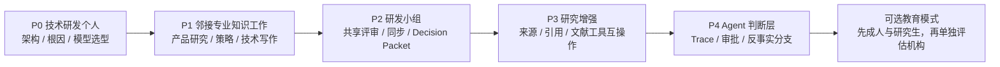

# ThoughsFlow 产品市场定位与切入策略调研

> 调研日期：2026-07-19
>
> 决策状态：市场切入建议；需要 6 周真实用户与付费实验验证
>
> 关联文档：[需求与架构调研](./AI分支对话产品需求与架构调研报告.md)、[产品原型蓝图](./PRODUCT_BLUEPRINT.md)、[跨平台技术路线](./跨平台技术路线与产品技术架构调研.md)

## 1. 结论先行

ThoughsFlow 不应在首发时定位成：

- 面向所有人的通用 AI 助手；
- K–12 或大众学生的 AI 学习产品；
- 自动执行任务的 Agent 工作流平台；
- 宽泛的“AI 科研工作台”或论文检索工具。

推荐采用“**品类相对通用，切入市场足够具体**”的三层定位：

| 层级 | 建议 | 作用 |
|---|---|---|
| 长期品类 | **AI 推演与决策工作区**（AI Decision Workspace） | 保留研究、写作、决策和未来 Agent 审查的扩展空间 |
| 首发市场 | **技术研发中的复杂调查与方案决策** | 让用户立即知道产品为谁解决什么问题 |
| 首个英雄场景 | **从同一事实和约束出发，比较多个技术假设，最后导出可审查的决策记录** | 形成可演示、可测量、可付费的完整工作结果 |

推荐首发定位句：

> **面向用 AI 处理复杂技术调查与决策的研发者，ThoughsFlow 让多条假设从同一事实基线展开、比较并收束为可审查的决策记录；工作区本地优先，每一步都保留由本应用锁定和发出的 Context 凭证。**

可以继续保留现有品牌主张：

> **让每条思路都有来路。**

英文版本：

> **An AI decision workspace for technical R&D. Branch hypotheses, compare evidence, and keep an auditable outbound context trail.**

关键战略判断是：

> **公司愿景可以通用，首发获客必须具体；产品可以为 Agent 预留接口，但首版要占据“执行前的人类判断层”。**

这是当前证据下最值得优先验证的 beachhead **假设**，不是已经得到留存、迁移成本和付费数据确认的市场结论。

## 2. 证据口径与调研边界

本文使用三种标签：

- **[事实]** 官方产品、定价、官方调查、原始论文或项目内已经核验的用户材料；
- **[推断]** 根据多项事实得出的市场判断，不等于市场规模或付费已经得到验证；
- **[建议]** 需要通过实验确认的产品与 GTM 决策。

本轮没有采用聚合型“市场规模报告”估算 TAM。官方厂商页面能证明其功能、定价和竞争投入，不能证明其用户满意度；Wiley、Elsevier、Microsoft 等厂商调查提供有价值的一手样本，但仍具有厂商、问卷和自选择偏差。

### 2.1 项目 MCP 调研边界

本轮继续使用项目 `.omp/mcp.json` 中的 TikHub MCP 服务，但没有把失败调用解释成“没有需求”：

- 小红书服务能够完成 MCP 工具发现；4 组搜索中 3 组返回 HTTP 500，1 组在上游抓取阶段返回 `RetryError`；
- Reddit、Twitter、知乎的工具发现也出现 HTTP 500；
- 因而本轮无法补充可复核的帖子、作者、评论或互动样本，也没有把错误响应计入市场判断；
- 配置内凭据没有进入报告或日志摘录。

Agent Reach 的 B 站检索得到三组**弱信号**：

- “AI 科研 工作流”结果中有多条约 5 万至 41 万播放的内容；
- “AI Agent 工作流”中一条吴恩达相关教程约 380 万播放；
- “AI 对话 分支”几乎没有相关结果。

可复核的动态搜索入口为：[AI 科研 工作流](https://search.bilibili.com/all?keyword=AI%20%E7%A7%91%E7%A0%94%20%E5%B7%A5%E4%BD%9C%E6%B5%81)、[AI Agent 工作流](https://search.bilibili.com/all?keyword=AI%20Agent%20%E5%B7%A5%E4%BD%9C%E6%B5%81)、[AI 对话 分支](https://search.bilibili.com/all?keyword=AI%20%E5%AF%B9%E8%AF%9D%20%E5%88%86%E6%94%AF)。播放量是抓取时的页面字段且会变化，只说明“科研工作流”和“Agent 工作流”已有较强类别语言和内容兴趣，**不能证明付费、留存，更不能证明用户需要 ThoughsFlow 的交互模型**。

此前已经核验的 X、Reddit 和竞品样本仍见[需求与架构调研第 2–5 节](./AI分支对话产品需求与架构调研报告.md)。

## 3. 先看产品现实，而不是先看市场大小

ThoughsFlow 的需求与架构已经定义、但多数仍待产品化实现的核心能力是：

1. 从精确回答版本创建分支，而不是复制整个聊天；
2. 默认只继承正确祖先路径，旁支不会自动污染当前路线；
3. 在发送前展示上下文清单，发送后保存不可变 Context Snapshot；
4. 本地工作区、BYOK、本地模型和多 Provider 边界；
5. 跨天恢复、搜索、导出和崩溃恢复；
6. Focus 阅读、路线图与 Trace 审计共享同一会话事实模型。

当前可运行原型只验证其中的交互语义，不接真实模型、不写数据库，也不能据此宣称本地持久化、不可变快照或崩溃恢复已经实现。

首版规划明确不具备：

- 教学目标、知识诊断、循序支架、练习与掌握度评估；
- 学校所需的班级、教师、家长、未成年人安全、管理员报表和 LMS 集成；
- 专业论文数据库、系统综述、自动引用核验和 PDF 结构化抽取；
- Agent 的工具执行、定时触发、凭据、可靠重试、沙箱、评估和运行治理；
- 企业多人协作、加密同步、RBAC、SSO 和采购所需的管理面。

因此，首发市场必须愿意为“**把复杂判断过程组织清楚**”付费，而不是要求产品先交付教学结果、科研计算结果或自动化 ROI。

## 4. 四个候选市场的项目级评估

以下分数是针对 ThoughsFlow 当前产品的判断，采用 1–5 分；不是通用市场排行榜，也不是 TAM。权重为：核心 JTBD 匹配 30%、差异化空间 20%、付费主体清晰度 15%、自助获客可达性 15%、销售/合规低摩擦 10%、未来扩张 10%。

| 市场 | JTBD 匹配 | 差异化 | 付费主体 | 自助获客 | 低摩擦 | 扩张 | 加权分 | 结论 |
|---|---:|---:|---:|---:|---:|---:|---:|---|
| **复杂技术调查 / 方案决策** | 5 | 4 | 4 | 4 | 4 | 5 | **88** | 推荐 beachhead |
| Agent 工作流 | 2 | 2 | 4 | 3 | 2 | 4 | 53 | 后续能力，不作为首发品类 |
| 通用 AI 生产力 | 3 | 1 | 3 | 1 | 4 | 5 | 52 | 可作为愿景，不可作为 GTM 文案 |
| 学习教育 | 3 | 2 | 2 | 2 | 1 | 4 | 48 | 成人/研究生可邻接，K–12 后置 |

### 4.1 综合市场矩阵

| 维度 | 学习教育 | 复杂技术调查 / 决策 | Agent 工作流 | 通用 AI 生产力 |
|---|---|---|---|---|
| 核心 JTBD | 学会、练习、反馈、掌握 | 并行探索假设，比较方案，解释为什么 | 连接系统并可靠执行多步任务 | 写作、搜索、总结、分析等日常提效 |
| 当前替代品 | ChatGPT Study Mode、Gemini Education、Khanmigo、NotebookLM | ChatGPT/Claude Projects、Deep Research、NotebookLM、Elicit、Obsidian + 多标签 | n8n、Zapier、Copilot Studio、LangGraph/LangSmith、代码自建 | ChatGPT、Claude、Microsoft 365 Copilot、Notion AI、Gemini |
| 竞争密度 | 极高，且大量免费/机构补贴 | 高但分散；“跨模型决策轨迹”相对空缺 | 极高，连接器与治理网络效应强 | 极高，模型与办公套件直接捆绑 |
| 付费主体 | 家长、学校、学区、大学；学生价格敏感 | 专业个人、技术负责人、研发团队 | IT、运营、平台工程与业务部门 | 个人、团队或企业统一采购 |
| 获客路径 | 教师、课程、校园、LMS 与机构销售 | 技术社区、案例模板、创始人试点、团队内扩散 | 模板、集成市场、开源生态、咨询与企业销售 | 大众品牌、模型能力、现有套件分发 |
| 当前能力匹配 | 中低 | **高** | 低 | 中，但购买理由模糊 |
| 最大风险 | 教学效果、未成年人和隐私合规 | 平台功能下沉、画布管理税、使用频率不足 | 执行可靠性、安全责任、集成维护 | 无差异、获客成本高、被免费功能吸收 |

竞争最少并不是选择技术研发的理由；事实上该市场也很拥挤。选择它，是因为用户任务和 ThoughsFlow 的三个不变量——不串支、说得清、不会丢——最一致。

## 5. 推荐 beachhead：技术研发决策，而不是泛科研

### 5.1 最窄 ICP

推荐第一轮产品验证只招募：

- 10–200 人 AI、机器人、硬件、开发者工具或企业软件公司的 Staff/Principal Engineer、Research Engineer、系统架构师、技术 PM 和技术创始人；
- 每周至少有一次持续数小时至数天的技术调研、故障假设分析或方案决策；
- 一个任务通常存在 3 个以上候选架构、根因、实验方向或供应商；
- 已经使用两个以上 AI 模型、ChatGPT/Claude 多标签、Obsidian/Notion/Markdown 或自有 API Key；
- 最终要向 2–10 人研发团队解释“为什么选 A、为什么没有选 B”；
- 在意未公开 IP、模型供应商、实际出站上下文和历史可恢复性；
- 当前不需要生物信息分析、HPC 作业或生产 Agent 自动调度。

这个 ICP 的典型任务是：

1. 软件/机器人系统架构选型；
2. 复杂故障的多个根因假设；
3. AI 模型、框架、数据库或供应商评估；
4. 研发实验方向与失败路线比较；
5. 技术尽调、RFC、ADR 和设计评审准备。

### 5.2 真实 Jobs-to-be-Done

1. **当一个技术问题有多种合理解释时，**我想从同一事实基线并行验证，而不是复制粘贴并重新解释约束。
2. **当两个模型或两条路线给出冲突结论时，**我想看见它们用了哪些不同前提、上下文和来源。
3. **当调查持续数天时，**我想在几分钟内恢复到上次的判断位置，而不是重读几十轮聊天。
4. **当我要做设计评审时，**我想把采纳路线、否决路线、证据和未决风险一起导出，而不是只贴一段最终答案。
5. **当内容包含内部 IP 时，**我想明确知道哪些内容保存在本机，哪一部分发给了哪个模型端点。
6. **当模型给出“几乎正确”的答案时，**我想保留替代推演并由人做最后判断，而不是直接委托执行。

Stack Overflow 2025 Developer Survey 的准确性题目有 33,244 份回答，其中 46% 不信任 AI 输出、33% 表示信任；“答案几乎正确但不完全正确”题目有 31,476 份回答，其中 66% 将其列为主要挫折。Agent 担忧题目有 28,930 份回答，其中 87% 担忧准确性、81% 担忧安全与隐私。[Stack Overflow 2025 AI 调查](https://survey.stackoverflow.co/2025/ai)

这些数字是开发者自选择调查，不代表所有研发人员；但它们支持一个产品假设：**专业用户的价值不只来自更快生成，还来自比较、验证和承担最终判断。**

### 5.3 需求与付费信号

Wiley 2025 年对 2,400 多名研究者的官方调查称，84% 已使用 AI、85% 认为效率提高；与此同时，64% 担忧错误或幻觉，58% 担忧隐私和安全。80% 使用通用 AI，只有 25% 使用专用研究助手，70% 使用过免费工具。企业研究者中 58% 获得组织提供的 AI 工具，高于全样本的 40%。[Wiley 官方调查发布](https://newsroom.wiley.com/press-releases/press-release-details/2025/AI-Adoption-Jumps-to-84-Among-Researchers-as-Expectations-Undergo-Significant-Reality-Check/default.aspx)

这不能直接证明用户愿意购买“分支对话”，但揭示了三个有用事实：采用已经发生、信任问题没有随采用消失、企业研发比学术个人更可能由组织付费。

专业研究工具已经建立价格锚点：Elicit 年付 Plus 为 11 美元/月、Pro 为 39 美元/月、Scale 为 89 美元/席/月；ResearchRabbit 的核心功能免费，RR+ 年付约 10 美元/月。[Elicit 定价](https://elicit.com/pricing)、[ResearchRabbit 定价](https://www.researchrabbit.ai/pricing)

这些价格只能说明专业用户会为明确的研究结果付费。若 ThoughsFlow 只是“漂亮的分支聊天”，它仍会与免费 ChatGPT、Obsidian、Zotero 和手工复制粘贴竞争，不能直接套用上述价格。

### 5.4 竞争格局和真正的空位

现有替代品分别覆盖了问题的一部分：

- ChatGPT 已向所有登录 Web 用户提供“Branch in new chat”，Projects 可以保存文件、聊天和项目记忆；因此“可以分支”已经不是充分差异。[ChatGPT Branch 官方发布说明](https://help.openai.com/en/articles/6825453-chatgpt-release-notes)、[ChatGPT Projects](https://help.openai.com/en/articles/10169521-projects-in-chatgpt)
- ChatGPT Deep Research 可以制定和修改研究计划、限定来源、输出引用和活动历史；因此“自动搜索并生成研究报告”也不是空白市场。[Deep Research 官方说明](https://help.openai.com/en/articles/10500283-deep-research-faq)
- NotebookLM 免费版已经提供来源约束问答、内联引用、报告、测验和交互式 Mind Map；它强于资料理解，但不是跨模型的决策路径管理。[NotebookLM 官方说明](https://support.google.com/notebooklm/answer/16164461)、[NotebookLM Chat](https://support.google.com/notebooklm/answer/16179559)
- Elicit、Consensus、ResearchRabbit、Litmaps 与 Zotero 已经占据论文检索、系统综述、引用图和文献管理；首版不应宣称替代它们。
- Notion Business 把 Agent、会议记录、企业搜索和 Research Mode 放在 20 美元/席/月套件中；通用知识工作能力正在被既有工作区捆绑。[Notion 定价](https://www.notion.com/pricing)

因此，相对可进入的交互层不是“搜索得更多”或“再做一张脑图”，而是：

> **跨模型技术判断：Context Diff + Branch Compare + Context Receipt + Decision Packet/ADR + 本地数据控制。**

### 5.5 Claude Science 带来的重要修正

Anthropic 于 2026 年 6 月 30 日推出 Claude Science beta，已把科学工具整合、可审计历史、本机/SSH/HPC、60 多个科学 skills/connectors、reviewer agent、可复现实验与 session fork 放在同一个科学工作台中。[Claude Science 官方发布](https://www.anthropic.com/news/claude-science-ai-workbench)

这意味着 ThoughsFlow 不应定位成：

- “科学家的分支对话工具”；
- 宽泛的 AI for Science 工作台；
- 生命科学、计算生物学或 HPC Agent；
- 仅靠“本地 + 分支 + 审计”竞争的科研工具。

更适合的空位是 Claude Science 没有专门定义的“**跨供应商、执行前、面向技术方案形成的人类判断层**”：架构、机器人方案、技术尽调、故障假设、模型选型和设计评审。

本地优先的承诺也必须准确：工作区默认在本机，但用户选择云 Provider 后，选中的 Context 仍会发给该 Provider；Context Receipt 证明发送了什么，不证明模型答案正确。

## 6. 为什么学习教育不适合作为首发市场

### 6.1 教育的 JTBD 与当前产品并不相同

学习产品的核心不是让学生产生更多分支，而是：

- 诊断已有知识和误解；
- 用适当难度的支架、提示和练习推进；
- 检查掌握度与迁移；
- 防止直接代做作业；
- 让教师、学校或家长理解学习效果；
- 保护未成年人数据并满足机构政策。

ChatGPT Study Mode 已在所有 ChatGPT 计划全球提供，通过苏格拉底式提问、分层解释、知识检查和上传课程资料帮助学习。[Study Mode 官方帮助](https://help.openai.com/en/articles/11780217-chatgpt-study-mode-faq) OpenAI 2026 年公布的 300 多名大学生随机研究称，微观经济学考试组相对无 AI 对照约高 15%，但神经科学组的差异无法与传统资源区分，且长期效果仍待研究。[OpenAI 学习结果研究](https://openai.com/index/understanding-ai-and-learning-outcomes/)

该研究是 OpenAI 对自家产品的早期结果，不能外推到 ThoughsFlow，但它说明教育产品必须证明学习结果，而不是只证明用户喜欢界面。

### 6.2 免费与机构级替代品非常强

- Gemini for Education 对符合条件的机构免费，并带管理、数据保护、Deep Research 和 Canvas；付费 Pro 再与 Workspace 应用捆绑。[Google Gemini for Education](https://edu.google.com/ai/gemini-for-education/)
- ChatGPT for Teachers 对验证通过的美国 K–12 教师免费至 2027 年 6 月，带 FERPA 对齐保护、SSO、RBAC 和分析。[ChatGPT for Teachers](https://help.openai.com/en/articles/12844995-chatgpt-for-teachers)
- Khan Academy Districts 的 1,000 人以下方案为每名学生每年 10 美元，包含 Khanmigo、管理员报告、SSO、实施支持、FERPA/COPPA 和无障碍要求。[Khan Academy Districts 定价](https://www.khanacademy.org/schools/pricing)
- ChatGPT Edu 和 Gemini Education 都以大学或机构工作区进入校园，购买决策涉及 IT、教师、隐私、政策和预算，而不仅是学生偏好。[ChatGPT Edu](https://openai.com/index/introducing-chatgpt-edu/)

UNESCO 的生成式 AI 教育指南明确要求数据隐私、年龄边界、机构验证和符合年龄的教学设计。[UNESCO 指南](https://www.unesco.org/en/articles/guidance-generative-ai-education-and-research)

### 6.3 结论

**[建议]** 不把 K–12、学校采购或“AI 家教”作为首发市场。当前产品没有教学法、学习测量、班级管理和机构合规栈，又面对大量免费产品。

可以保留的邻接用户是：

- 研究生、博士生和成人自主学习者；
- 他们使用 ThoughsFlow 的原因应是研究问题与假设管理，而不是系统承诺“教会”；
- 如果后续数据显示用户会主动回看分支、纠正误解并形成知识迁移，再单独验证“学习模式”。

## 7. 为什么 Agent 工作流不适合作为首发品类

### 7.1 Agent 用户购买的是可靠执行

Agent 工作流的核心 JTBD 是把跨系统的重复或长任务交给软件执行，并获得可量化结果。真正的产品门槛包括：

- OAuth、凭据和连接器生命周期；
- 定时、Webhook、队列和后台持续运行；
- durable execution、幂等、重试、补偿和故障恢复；
- 沙箱、网络/文件权限、Prompt Injection 防御；
- 人工审批、接管、成本上限和并发控制；
- trace、eval、版本、回放和告警；
- RBAC、SSO、审计、数据保留和合规。

一张节点画布或一棵分支树并不等于这些能力。ThoughsFlow 当前的 `parent_run_id` 描述的是“这次思考基于哪个回答”，不是可执行工作流 DAG。

### 7.2 竞争层已经拥挤

- OpenAI 已提供 Responses API、内置工具、Agents SDK 和 tracing，明确把生产 Agent 的可见性与编排作为平台能力。[OpenAI Agent 工具](https://openai.com/index/new-tools-for-building-agents/)
- LangSmith/LangGraph 覆盖部署、trace、eval、sandbox 和自托管；Plus 为 39 美元/席/月再按用量计费。[LangSmith 定价](https://www.langchain.com/pricing)
- n8n 以工作流执行量计费并提供自托管、队列、凭据和企业环境；Zapier 依靠大量应用动作、MCP、模板与托管连接形成生态。[n8n 定价](https://n8n.io/pricing/)、[Zapier 定价](https://zapier.com/pricing)
- Notion、Microsoft 365 Copilot 和 Copilot Studio 已把 Agent 放入现有团队数据、权限和采购体系。[Notion 定价](https://www.notion.com/pricing)、[Microsoft 365 Copilot 定价](https://www.microsoft.com/en-us/microsoft-365-copilot/pricing)

Microsoft 2026 Work Trend Index 基于 20,000 名 AI 用户调查和 Microsoft 365 信号，强调规模化 Agent 需要身份、权限、政策、人工评估和管理控制面。[Microsoft 2026 Work Trend Index](https://www.microsoft.com/en-us/worklab/work-trend-index/agents-human-agency-and-the-opportunity-for-every-organization) 这是供应商研究，不是中立市场份额，但很好地说明了企业购买门槛。

### 7.3 适合 ThoughsFlow 的 Agent 扩展

ThoughsFlow 不应以后正面变成 n8n 或 Zapier，而应把 Agent 放在当前优势的下游：

1. 导入 Agent run/trace，形成可审计时间线；
2. 从某一步结果创建反事实分支；
3. 比较模型、Prompt、工具路径和结果；
4. 对高风险 Tool Call 批准、修改或拒绝；
5. 把经过人类验证的路线导出为 Agent spec；
6. 只有出现持续需求后，才增加有限、受审批的执行模式。

定位关系应是：

> **先帮助人把问题想清楚，再让 Agent 执行；未来 Agent 的关键步骤也要可检查、可分支、可批准和可回放。**

## 8. 为什么不能直接定位成“通用 AI 生产力”

通用定位看似市场最大，实际会让用户无法回答“为什么已有 ChatGPT/Claude/Copilot 还要安装 ThoughsFlow”。

- ChatGPT 提供免费计划，个人 Plus 的公开价格锚点为 20 美元/月，并已包含 Projects、Canvas、搜索、Deep Research、文件和分支。[ChatGPT 定价](https://openai.com/chatgpt/pricing)
- Claude 个人 Pro 公开价格为 20 美元/月，并有 Projects、Research、Integrations 和代码/工作能力。[Claude 计划](https://support.anthropic.com/en/articles/11049762-choosing-a-claude-ai-plan)
- Notion Business 为 20 美元/席/月，已包含 Agent、会议记录、企业搜索和 Research Mode。[Notion 定价](https://www.notion.com/pricing)
- Microsoft 365 Copilot 直接进入 Word、Excel、PowerPoint、Outlook 和 Teams，并继承 Microsoft 采购与数据分发。[Microsoft 365 Copilot](https://www.microsoft.com/en-us/microsoft-365-copilot/pricing)

“通用”还会迫使小团队同时追赶语音、图片、搜索、移动端、连接器、记忆、协作和模型能力，稀释真正差异。

**[建议]** 底层数据模型和品牌愿景保持通用，但首页、案例、模板、招募和付费实验必须聚焦技术研发决策。用户验证后再换首页，而不是预先把文案写给所有人。

## 9. 定位、ICP 与 anti-ICP

### 9.1 三层定位

```text
公司愿景：帮助人保留、比较和验证与 AI 共同形成的思路
产品品类：AI 推演与决策工作区（本地优先、出站 Context 透明）
首发用例：技术方案 / 假设 / 根因的多路线比较与决策记录
```

推荐首页首屏：

> **复杂技术问题，不该被塞进一条聊天。** 从同一个回答分出多条假设，比较模型与上下文，最后导出一份说得清“为什么”的技术决策记录。

三个证明点：

1. **Branch from the exact answer**：从准确回答版本出发，不复制错误上下文；
2. **See what was sent**：每次请求都有本应用实际锁定并发出的 Context Receipt 和差异；Provider 侧不可见的系统处理不在承诺内；
3. **Turn exploration into a decision**：把选中路线、否决理由和开放问题导出为 Decision Packet/ADR。

### 9.2 首发 anti-ICP

首轮明确不服务：

- 一次性短问短答和主要使用语音/图片的普通用户；
- K–12 学生、家长、教师或学校采购；
- 只需要检索论文与生成综述的学术用户；
- 需要生命科学工具链、HPC 或实验自动化的科研团队；
- 要求定时、Webhook、OAuth、生产重试和 SLA 的 Agent 团队；
- 第一版就要求多人实时协作、SSO 和集中管理的大企业；
- 把“可审计上下文”误解成“保证模型正确或可重复相同答案”的高风险场景。

### 9.3 应避免的类别名称

- 不叫“AI 思维导图”：用户会期待自动生成静态脑图；
- 不叫“AI Research Assistant”：用户会期待搜索、引用和论文数据库；
- 不叫“Agent Builder”：用户会期待连接器和可靠执行；
- 不叫“第二大脑”：会与 Obsidian/Notion 的知识库心智竞争；
- 不叫“更好的 ChatGPT”：会被模型能力和免费功能定义。

推荐使用“AI 推演与决策工作区”“技术决策工作区”或英文 `AI Decision Workspace`。

## 10. 产品能力应如何配合定位

首发不需要增加一个庞大的研发垂直系统，但必须把现有能力包装成完整结果：

| 优先级 | 能力 | 市场作用 |
|---|---|---|
| P0 | 精确回答分支、Branch Compare、Context Diff | 核心推演与差异化 |
| P0 | Context Receipt：实际出站内容、模型、端点、时间 | 透明与数据边界 |
| P0 | “采纳 / 否决 / 待验证”标记 | 把树变成决策过程，而非聊天历史 |
| P0 | Decision Packet / ADR Markdown 导出 | 让团队评审看到可交付结果 |
| P0 | ChatGPT/Claude/Markdown 对话导入的最小路径 | 降低切换成本，直接处理已有长对话 |
| P0 | 本地工作区、BYOK/Ollama、搜索和崩溃恢复 | 专业工具的可信基础 |
| P1 | 文件/网页片段的来源标签、Claim–Source 关联 | 进入更严格的研究任务 |
| P1 | 评论、只读分享、加密同步和团队模板 | 从个人工具扩到研发小组 |
| P2 | Agent trace 导入、审批与反事实分支 | 延伸到执行后的检查层 |

不要为了“研发”马上开发：完整 IDE、代码执行沙箱、文献数据库、专利库、实验仪器连接、HPC 调度或项目管理套件。

## 11. 付费主体、价格假设与获客

### 11.1 使用者和购买者

第一阶段：

- 使用者与付款者通常是同一人：资深工程师、架构师、技术创始人；
- 也可以由研发负责人报销个人工具；
- 产品采用本地 + BYOK，避免首版同时承担模型成本与用量风险。

第二阶段：

- 使用者仍是研发个人贡献者；
- 经济买家变成 CTO、VP Engineering、R&D Lead 或产品研发负责人；
- 必须先有加密同步、共享评审、权限、团队模板和管理边界，才有资格按席位销售。

### 11.2 价格只做实验，不提前冻结

依据 ChatGPT/Claude 20 美元/月、ResearchRabbit 约 10 美元/月和 Elicit 11–39 美元/月的公开锚点，以及 TypingMind 调研时页面显示的 39/79 美元一次性层级与 99 美元 Premium 限时促销价（页面原价 198 美元）、Heptabase 11.99 美元/月或 107.88 美元/年的更接近工具锚点，建议先测试：[TypingMind 定价](https://www.typingmind.com/buy)、[Heptabase 定价](https://support.heptabase.com/en/articles/12990121-pro-premium-and-premium-plans-pricing-faq)

- Founding Pro：**59 美元 / 399 元一次性，当前版本永久使用，含 12 个月更新，模型费用 BYOK**；
- 可选更新续费：**29 美元 / 199 元一年**，不续费仍可继续使用已有版本；
- 验证成立后的常规定价再测试 **79–99 美元**；
- 团队版：在同步与共享成熟后测试 **25–35 美元/席/月**。

这些仍是验证价格，不是最终定价。若用户只是为了分支聊天，价格应显著更低甚至无法成立；只有 Decision Packet、跨天恢复和 Context Diff 能稳定节省评审与返工，才有独立软件的收费依据。月订阅应等到同步、团队协作或持续云服务成立后再测试。

### 11.3 获客顺序

1. 找 5–10 个 AI、机器人、硬件、开发者工具团队做创始人主导试点；
2. 用真实模板获客：架构选型、根因假设树、模型评估、实验路线、技术尽调；
3. 让用户导入一段现有长聊天，在 10 分钟内得到第一条准确分支；
4. 提供可脱敏的 Decision Packet/ADR 导出，让成果进入 Git、PR、RFC 或评审会；
5. 在 GitHub、技术社区、研发 Discord/论坛、AI 本地模型社区发布具体案例，不宣传抽象“思维更清晰”；
6. 从个人专业用户进入团队，而不是首日做企业销售；
7. 中文先用创始人可触达的研发者验证，英文页面同步建立候选池；不要在尚未有留存时同时运营多个垂直市场。

## 12. 扩张顺序



阶段说明：

1. **技术研发个人**：先验证分支和 Context Receipt 是否改善真实决策；
2. **邻接知识工作**：扩到技术 PM、产品研究、策略分析和长文作者，但仍围绕复杂项目；
3. **研发小组**：用 Decision Packet、评论和共享路线形成团队价值；
4. **研究增强**：通过 Zotero/Markdown/网页片段与来源关系进入更严格研究，不自建论文数据库；
5. **Agent 判断层**：检查和批准执行，而不是重做自动化平台；
6. **教育**：只在成人/研究生真实使用证明学习价值后另立教学实验；K–12 不是自然功能扩张，而是新的产品和合规业务。

## 13. 六周市场验证方案

最大风险不是技术，而是用户是否在漂亮演示之后继续回访旧分支。验证必须使用真实任务和付费行为。

### 第 1 周：基线与招募

- 招募 25–30 名候选人，筛选出 20 名合格目标 ICP，并从中完成 12–15 次深访，覆盖工程架构、AI/机器人研发、技术 PM 和创始人；
- 每人带一个过去 30 天真实发生的复杂决策；
- 至少一半能展示过去两周内两次真实的上下文污染、重开会话、重复解释或方案分叉事故；否则问题频率不足；
- 记录其当前基线：ChatGPT/Claude 标签数、笔记工具、恢复时间、评审材料制作时间和返工；
- 排除主要需求是论文搜索、写代码或 Agent 自动执行的人，避免错误样本。

### 第 2 周：定位信息实验

用同一原型做四个落地页，不改变功能：

1. 技术研发决策；
2. 学习与理解；
3. Agent 可视化与审查；
4. 通用 AI 思考工作区。

衡量的不只是点击率，而是：

- 符合 ICP 的预约率；
- 用户是否能复述产品用途；
- 是否愿意导入真实对话；
- 是否留下一个即将发生的实际任务；
- 技术研发版本的“合格预约 / 访问”是否至少是第二名的 1.5 倍。

若通用版本点击高但没有真实任务或付费意愿，不应判定其胜出。

### 第 2–3 周：受控任务对照

让每位用户用两种方式处理同类任务：

- 基线：ChatGPT/Claude Projects + 其现有笔记；
- ThoughsFlow：精确分支、Context Diff、Decision Packet。

任务必须包含至少 3 个候选路线，并在 48 小时后继续。记录：

- 创建分支和回访分支的比例；
- 48 小时后恢复到正确判断位置的时间；
- 用户能否准确预测本应用本轮会锁定并发送什么 Context；
- 是否发现误带或漏带 Context；
- 评审者能否看懂为何采纳 A、否决 B；
- 总任务时间、返工轮数和主观认知负担。

### 第 2–6 周：四周真实项目留存

让首批 20 名合格用户在第 2 周同时进入可运行版本，连续观察 28 天，不提供 Agent/MCP 执行。受控任务、定位实验和付费实验与该留存队列并行进行，避免只测 14 天新鲜感。

建议继续的最低门槛：

- 至少 60% 在真实项目中创建 3 条以上有不同后续的分支；
- 至少 50% 的激活用户在 24 小时后返回过旧分支，而不是只创建不使用；
- 至少 50% 在第二个真实任务中再次选择 ThoughsFlow；
- 至少 40% 到第 4 周仍完成过一次有意义的分支、回访、Context 核查或 Decision Packet 动作；
- 80% 以上能正确说明下一次请求的 Context 边界；
- 多数用户在 48 小时恢复任务时快于自己的基线；
- 至少 3 份 Decision Packet 被真正用于 PR、RFC、ADR 或团队评审。

### 第 4 周：付费实验

不要只问“愿意付多少钱”，提供真实购买页：

- 59 美元 / 399 元 Founding Pro；
- 当前版本永久使用，含 12 个月更新；
- 14 天退款，模型 API 费用另付；
- 研发负责人试点：25–35 美元/席/月，承诺团队能力上线后付费。

购买页在第 4 周开始时开放，使最早一批购买者能在第 6 周决策前走完整个 14 天退款窗口。通过门槛：完整经历退款窗口的 12 名真实项目用户中至少 4 名实际购买，退款不超过 1 名；或至少 2 名研发负责人签署有明确金额与启动时间的付费试点意向。可退款预订金可以降低产品尚未完成的风险，但不能替代最终购买指标。

### 第 6 周：决策与收敛

比较四类证据：

1. 任务结果是否更好；
2. 分支是否真的被回访；
3. Context Inspector 是否纠正了真实错误；
4. 用户是否实际付款。

只有四者共同成立，才继续扩大研发定位。首页点击、B 站播放、访谈中的“很酷”和第一次画布截图都不是继续投资的充分条件。

## 14. Kill criteria 与转向条件

满足任一主要条件，应停止当前定位或显著收缩产品，而不是继续增加画布功能：

1. 少于 30% 的激活用户在 24 小时后返回旧分支，应停止 tree-first 定位；30%–49% 只继续迭代，达到 50% 才通过；
2. 用户主要把分支当临时草稿，最终仍回到线性 ChatGPT 完成工作；
3. 相比 ChatGPT Projects + Obsidian，恢复任务、解释决策和返工没有可测改善，或 60% 以上目标用户认为原生 Projects 已足够好且不愿迁移；
4. 少于 20% 的用户能指出 Context Inspector 曾发现或避免真实上下文错误，只提供安全感；
5. 30+ Turn 后画布管理时间抵消了分支收益；
6. 用户只有在加入工具执行、定时和连接器后才愿付费——这表明他们需要 Agent 平台而不是当前产品；
7. 少于 4/12 的合格用户愿意按 59 美元 / 399 元购买，且团队负责人也无明确预算；
8. 头部平台在验证期内补齐跨模型树、Context Diff 与决策导出，使切换收益不足；
9. 技术研发定位无法获得足够真实项目，而教育或其他细分在同一原型上同时表现出更强留存和真实付款；此时才启动新的垂直验证；
10. 超过一半目标用户的复杂工作已经迁移到 Codex、Claude Code 等 Agent，而产品无法导入或审查这些 Run；此时应单独验证 Agent Review Layer，停止把纯对话组织当成唯一入口。

也有三个“功能收缩而非市场放弃”的条件：

- 如果 Focus 明显优于 Canvas，就把画布降为路线图；
- 如果用户很少手动调整 Context，但会核查凭证，就保留只读 Receipt，隐藏高级编辑；
- 如果用户需要的是 Decision Packet 而非长期知识库，就强化导出，不发展成第二大脑。

## 15. 最终定位决策记录

**决定：** ThoughsFlow 以“AI 推演与决策工作区”为长期品类，以“技术研发中的复杂调查与方案决策”为首发市场，以架构、故障假设、模型/工具选型和技术尽调为英雄场景。

**Beachhead ICP：** 10–200 人科技公司的 Staff/Principal Engineer、Research Engineer、系统架构师、技术 PM 与技术创始人；他们每周处理多路线技术问题，需要向小型研发团队说明判断过程，并在意内部 IP 与模型上下文边界。

**不进入：** K–12、泛学习、宽泛科学工作台、论文搜索、自治 Agent 编排、普通短问答和第一版企业协作。

**差异化承诺：** 不是“能分支”，而是“从精确回答分支、不串上下文、比较路线、生成出站 Context Receipt，并把探索转成可审查的 Decision Packet/ADR”。

**扩张路径：** 技术研发个人 → 邻接专业知识工作 → 研发团队 → 来源与研究工具互操作 → Agent 审查/审批层；教育另行验证，成人与研究生先于 K–12。

**必须验证：** 用户是否在 24–48 小时后返回旧分支、是否更快恢复复杂项目、是否真正纠正上下文错误、是否把 Decision Packet 用于评审，以及是否真实付款。

最终应坚持一句话：

> **产品架构可以通用，市场入口不能通用；先成为技术研发者处理复杂调查与决策的最好工具，再决定要不要成为更广泛的人机思考基础设施。**
