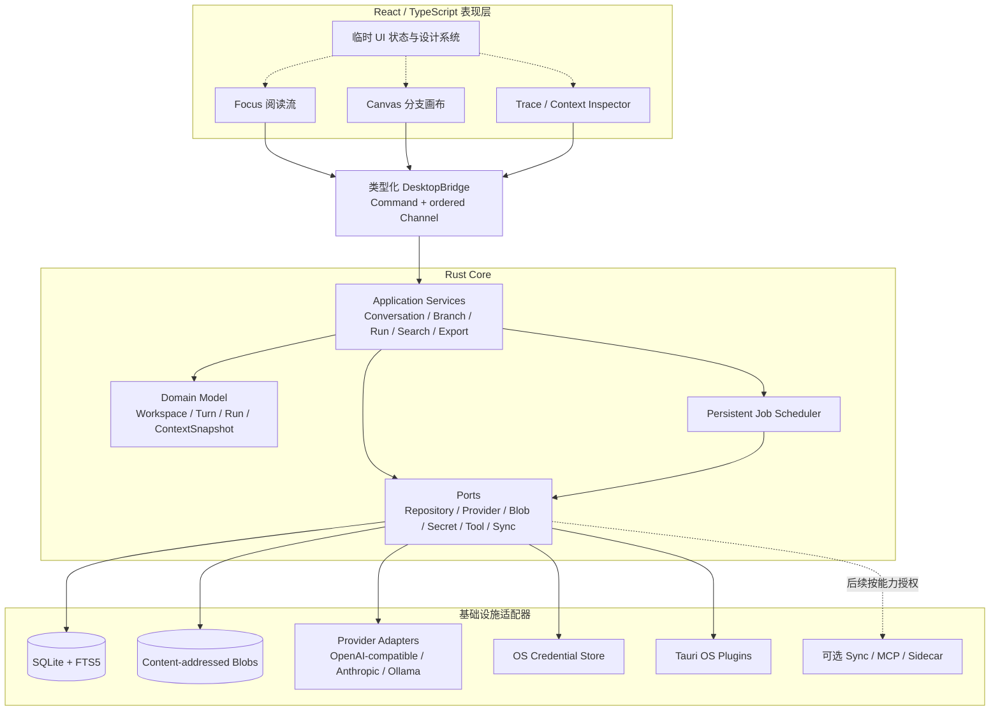
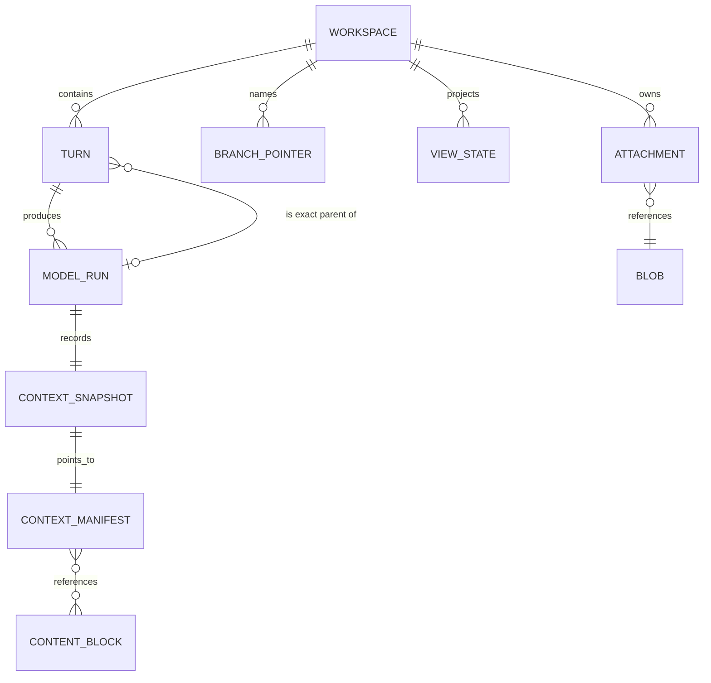
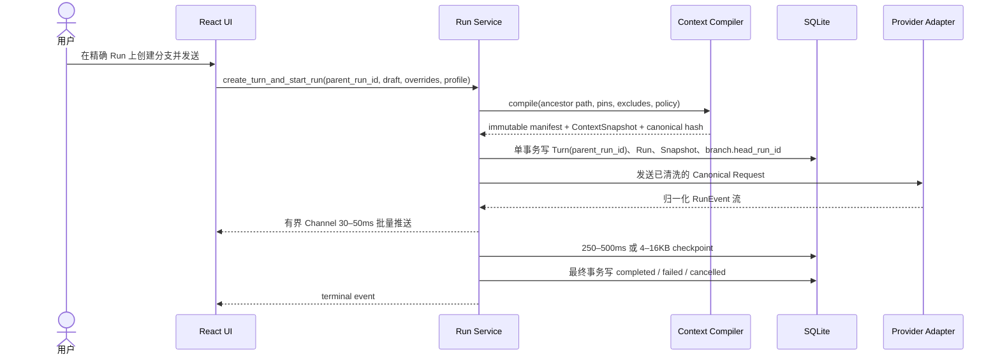

# ThoughtsFlow 跨平台技术路线与产品技术架构调研

> 调研日期：2026-07-19
>
> 决策状态：建议方案，需通过两周三平台技术验证后冻结
>
> 关联文档：[产品需求与架构调研报告](./AI分支对话产品需求与架构调研报告.md)、[产品蓝图](./PRODUCT_BLUEPRINT.md)

## 1. 结论先行

ThoughtsFlow 当前最合适的主路线是：

> **Tauri 2 + React + TypeScript + Vite 负责跨平台界面，Rust 负责本地领域核心与系统能力；SQLite 领域表是权威会话事实源，FTS5 只是可重建索引。**

P0 目标支持 **macOS、Windows、Linux 桌面端**，最终支持范围以两周验证冻结的 OS、架构和安装包矩阵为准。浏览器和移动端不是把桌面界面原样缩小，而是在同步基础完成后提供 Web Lite 和移动伴侣；开始移动端开发前，先验证 Tauri 2 Mobile 的核心插件覆盖，确有缺口时才把 Capacitor 作为受限范围的移动端备选。

这个选择最符合本项目，而不是普遍适用于所有跨平台应用，原因是：

- 现有原型已经是 React/TypeScript，产品又以长文本、Markdown、选择复制、键盘操作和分支画布为核心，Web UI 生态非常契合；
- Tauri 使用系统 WebView，不随应用打包完整 Chromium，安装体积优势是结构性的；Rust 适合承载 SQLite、文件、检索、流式网络、任务调度和安全边界；
- 视觉目标可以做到**设计语言、布局、交互和信息密度一致**，但不能承诺不同系统 WebView 的字体栅格化逐像素一致；
- 通过窄而稳定的 `DesktopBridge` 隔离宿主，如果三平台技术验证证明系统 WebView 不满足要求，可以复用 React UI、DTO、schema 和纯 Rust 领域 crate；Electron 宿主、权限和 Rust 托管方式仍需重新实现；
- 不引入本地微服务、云数据库、CRDT、向量库或第二套桌面壳，能控制首版复杂度和长期维护成本。

推荐的平台节奏如下：

| 阶段 | 产品形态 | 技术路线 | 能力范围 |
|---|---|---|---|
| P0 | 桌面核心 | Tauri 2 + React/TS + Rust + SQLite | 工作区、分支、上下文审计、模型调用、FTS5、手动完整备份/恢复、导出与崩溃恢复 |
| P1 | 桌面增强 | 同一主架构 | 附件、多 Provider、无障碍与发布完善 |
| P2a | 多设备同步基础 | 版本化加密 mutation/outbox + Blob | 先解决身份、密钥、幂等、冲突和同步，不同步活动 SQLite 文件 |
| P2b | Web Lite / 移动伴侣 | Web 使用 React + 纯 Rust domain WASM + 加密同步缓存；移动优先验证 Tauri 2 Mobile | 查看、继续单分支、采集、通知；依赖 P2a，不照搬大型画布 |
| P3 | 多人协作 | 只给协作文档引入 CRDT | 会话图和运行记录仍使用关系模型，不把整个工作区 CRDT 化 |

在 P2a 之前可以发布一个不保存正式工作区的浏览器演示，或支持手工导入的独立工作区；但不能把它称为“查看并继续桌面对话”的连接型 Web Lite。P2b 的 domain WASM 只负责共享业务不变量；若再要求完整离线 Web，还要引入 SQLite WASM/OPFS、浏览器后台与文件恢复策略，应单独立项，不在当前路线中同时承诺。

## 2. “跨平台”在这个产品里的准确含义

跨平台不应该被定义成“所有平台显示完全相同的一块 UI”，而应分成四层：

1. **产品语义一致**：Turn、Run、Branch、Context Snapshot 在所有平台含义相同；
2. **数据与协议一致**：同一 schema、导出格式、Provider 事件和同步操作可以跨端解释；
3. **视觉系统一致**：颜色、字号层级、间距、圆角、图标、动效和状态反馈来自同一套 Token；
4. **交互适配平台**：桌面使用多栏、鼠标、键盘和空间画布；移动端使用层级导航、触控和渐进披露；Web Lite 尊重浏览器沙箱。

因此，本项目的目标应是**同一套领域规则和应用契约，适配不同设备形态**，而不是强求所有界面逐像素一致。桌面端运行完整本地 Rust Core；连接型 Web Lite 把不依赖 Tauri/SQLx/Tokio 的纯 Rust domain crate 编译为 WASM，在浏览器内执行 Context Compiler 和不变量校验，再连接加密同步缓存；移动端是否复用完整 Core 由 Tauri Mobile 验证决定。窗口、文件选择、系统托盘、通知、快捷键、触觉反馈等能力由薄平台适配器承担。

## 3. 调研方法与证据边界

本次调研使用了三类材料：

1. 当前需求报告和三套交互原型，用于提取 ThoughtsFlow 的真实约束；
2. 各框架官方文档、官方仓库、发布说明和 SQLite 官方资料，用于核验技术能力；
3. 项目 `.omp/mcp.json` 中配置的 TikHub MCP 服务，用于尝试补充 Reddit、Twitter、知乎和小红书的开发者讨论。

MCP 调研过程能够完成协议初始化和工具发现，说明本地配置、认证格式和服务端 MCP 接口可用；但四个平台的搜索调用在上游抓取阶段均返回重试后失败。备用 OpenCLI 又因浏览器桥未连接而无法取得可复核的社交原文。因此，本报告**没有把未取回的社交内容当作证据**，也没有泄露配置中的凭据。技术结论以一手官方资料和项目自身约束为主，原需求报告里已经核验过的用户痛点仍可作为产品证据。

这一区分很重要：社区口碑能帮助发现兼容性问题，却不能证明某个框架一定更快、更省内存。性能结论最终必须来自 ThoughtsFlow 自己的三系统安装包和真实工作区基准。

## 4. 项目约束与评估标准

### 4.1 产品约束

- 主界面是长文本阅读流、Context Inspector 和可缩放分支画布的组合；
- 数据默认本地保存，API Key、附件和真实模型请求必须有清晰的安全边界；
- 单个工作区可能从 100 个 Turn 增长到 5,000 个以上；
- 需要稳定的流式输出、取消、断流恢复、搜索、导入导出和崩溃恢复；
- 首版团队不应同时维护多个 UI 技术栈、多个数据库或本地微服务；
- 未来可能增加移动端、同步、Agent 和 MCP，但这些能力不能反向污染首版核心。

### 4.2 加权评估

下表是针对 ThoughtsFlow 的工程判断，分数为 1–5，满分 100；它不是通用框架排行榜，也不是性能基准。

| 路线 | 产品 UI 契合 20% | 资源/包体 15% | 视觉一致 15% | 本地能力/安全 15% | 桌面+移动战略覆盖 10% | 复用/维护 15% | 成熟生态 10% | 加权分 |
|---|---:|---:|---:|---:|---:|---:|---:|---:|
| **Tauri 2 + React** | 5 | 4 | 3 | 5 | 4 | 4 | 4 | **84** |
| Electron + React | 5 | 2 | 5 | 4 | 2 | 4 | 5 | 79 |
| Flutter | 3 | 4 | 5 | 4 | 5 | 3 | 4 | 78 |
| Compose Multiplatform | 3 | 4 | 4 | 4 | 4 | 3 | 4 | 73 |
| PWA + Capacitor | 4 | 4 | 3 | 2 | 4 | 4 | 4 | 71 |
| Wails v2 + React | 4 | 4 | 3 | 4 | 2 | 4 | 3 | 71 |
| React Native / Expo | 3 | 4 | 4 | 3 | 3 | 3 | 4 | 68 |

分数背后的决定性取舍是：

- Electron 用更大的运行时和包体换取三个桌面系统统一 Chromium；
- Flutter 用自己的渲染体系换取原生端视觉控制，但会重写现有 UI，并弱化 DOM、长文本和浏览器生态优势；
- React Native/Expo 是成熟的移动优先方案，但桌面端仍依赖平台社区项目，无法形成一个同等成熟的统一交付面；
- Compose Multiplatform 适合 Kotlin 团队和原生 UI，但对现有 React 资产、Web 优先阅读体验和前端人才生态的复用不如当前路线；
- PWA/Capacitor 很适合试用入口与移动伴侣，却无法单独保证桌面级文件、密钥、长时后台任务和本地数据可靠性；
- Wails v2 是优秀的轻量 Go 桌面壳，但没有稳定移动覆盖；v3 的移动端仍处于 Alpha/Experimental 阶段，不应进入首版核心路径。

## 5. 主流方案逐项结论

### 5.1 Tauri 2 + React：推荐主路线

Tauri 由 WebView 承载 UI，以 Rust 进程提供系统能力。官方架构说明它不随应用捆绑浏览器引擎，最小应用可以非常小；这能证明**安装体积的结构性优势**，但不能把官方最小示例数字当作本产品预算。[Tauri 架构](https://v2.tauri.app/concept/architecture/)、[Tauri 起步说明](https://v2.tauri.app/start/)

它和 ThoughtsFlow 的匹配点是：

- React 原型、Markdown、文本选择、快捷键和 SVG/Canvas 画布可以直接演进；
- Rust 原生层适合做 Context Compiler、SQLite Repository、Provider Gateway、SSE/NDJSON 等流解码、文件与任务队列；
- capabilities 可以按窗口和命令声明最小权限，适合把 AI 生成内容视为不可信输入；
- 文件、Deep Link、窗口状态和签名更新等官方插件覆盖首版的大部分系统能力；数据库由 Rust Repository/SQLx 独占，不向前端开放 SQL 插件；
- Tauri Channel 适合传送有序流事件，避免逐 token 调用 IPC。

需要接受的代价：Windows 使用 WebView2，macOS/iOS 使用 WKWebView，Linux 使用 WebKitGTK，Android 使用系统 WebView。不同引擎会带来字体、滚动条、输入法和少量 CSS 差异，因此必须做三系统安装包 QA，不能只在 Chrome 中开发。[Tauri WebView 版本](https://v2.tauri.app/reference/webview-versions/)、[Capabilities](https://v2.tauri.app/security/capabilities/)、[Tauri Channel](https://v2.tauri.app/develop/calling-frontend/)

另一个需要纠正的常见说法是“Tauri 一定比 Electron 省内存”。Tauri 官方仓库的讨论明确指出，WebKit 与 Chromium、USS/PSS、共享内存、GPU 进程和测试负载会改变结果；旧的简单对比不能当科学结论。对本项目，安装包优势可以预期，RAM 和能耗必须实测。[Tauri 内存基准讨论](https://github.com/tauri-apps/tauri/issues/5889)

### 5.2 Electron + React：明确的回退路线

Electron 将固定版本的 Chromium 和 Node.js 随应用分发，因此三个桌面系统的浏览器行为、CSS 和新 Web API 更可控，Node/npm 生态也最成熟。这是其视觉一致性和兼容性的核心优势；代价是官方文档承认多数 Electron 应用体积超过 100 MB，并且 Chromium 多进程带来固定资源成本。[Why Electron](https://www.electronjs.org/docs/latest/why-electron)

只有在两周验证出现下列情况时改选 Electron：

- 核心画布或编辑器必须依赖 Chromium-only API、WebGPU 或特定嵌入式网页行为；
- Windows、macOS、Linux 被要求达到接近像素级的一致；
- 目标企业旧系统的 WebView 版本不可控；
- 产品核心长期依赖大量 Node-only SDK 或原生 npm 模块；
- 团队无法承担 Rust 双栈。

如果选择 Electron，仍应保留 renderer sandbox、context isolation、严格 preload API、IPC sender 校验和 CSP，并维持 Rust/SQLite 或受控 main-process 数据层，不能让 React 组件直接拥有 Node 权限。[Electron 安全清单](https://www.electronjs.org/docs/latest/tutorial/security/)

不建议同时交付 Tauri 与 Electron。正确做法是维持一个宿主无关的 `DesktopBridge` 契约，只在验证失败时整体切换宿主。

为了让回退成本可控，领域与应用核心应是没有 Tauri 依赖的 Rust crate，Tauri command 只做 DTO 映射。若切换 Electron，需要在技术验证阶段二选一评估：把 Core 编译为受控 sidecar 并使用 stdio 协议，或通过 Node 原生绑定托管；这仍是明确的宿主改造，不能描述成零重写。

### 5.3 Flutter：原生多端优先时的第二选择

Flutter 正式支持 Android、iOS、Windows、macOS、Linux 和 Web，自有渲染管线很适合复杂动画、自定义画布和高度统一的视觉系统。[Flutter 支持平台](https://docs.flutter.dev/reference/supported-platforms)、[Flutter 架构](https://docs.flutter.dev/resources/architectural-overview)

它没有成为本项目首选，主要不是性能问题，而是产品形态和已有资产：

- 当前 React 原型和 Web 组件需要重写；
- ThoughtsFlow 的核心是大量可选择长文本、Markdown、链接、代码块和键盘操作，DOM/Web 生态更直接；
- Flutter Web 需要额外下载约 1.1 MB 的 skwasm 或 1.5 MB 的 CanvasKit 渲染器，默认 Web 语义/无障碍也需要显式开启；
- Impeller 在 iOS 和较新 Android 上成熟，但 macOS 仍为 Preview、Windows/Linux 为 Experimental，不能推导出六端性能完全一致。[Flutter Web 渲染器](https://docs.flutter.dev/platform-integration/web/renderers)、[Web FAQ](https://docs.flutter.dev/platform-integration/web/faq)、[Impeller 平台状态](https://flutter.dev/go/can-i-use-impeller)

如果产品优先级改变为“未来一年内移动端是主入口、五个原生平台同等重要、自由画布和品牌动画高于浏览器/长文本体验”，应重新评估 Flutter。那时应使用 Flutter UI + Pure Dart Domain + Repository adapters，而不是把 Web 页面嵌进 Flutter。

### 5.4 React Native / Expo 与 Compose Multiplatform

React Native/Expo 的优势是移动端生态、React 思维和原生控件，但 React Native 官方将 Windows、macOS 等列为 out-of-tree 平台；这些平台有各自维护主体、版本节奏和能力差异，React Native for Windows 的新架构也仍有兼容限制。Expo 的统一工作流主要面向 Android、iOS 和 Web。对“桌面是主产品”的 ThoughtsFlow，它会把最重要的平台放在较碎片化的交付路径上，对高密度画布、桌面文本选择和快捷键也需要更多平台专项工作。[React Native 平台](https://reactnative.dev/docs/out-of-tree-platforms)、[Expo FAQ](https://docs.expo.dev/faq/)、[React Native for Windows 新架构](https://microsoft.github.io/react-native-windows/docs/new-architecture/)

Compose Multiplatform 是比 React Native 更强的原生候选：官方将 Android、iOS 和 Desktop 标为 Stable，桌面覆盖 Windows、macOS、Linux，统一 Compose UI 和 Canvas 很契合分支图；Ktor 与 SQLDelight 也能组成完整的本地数据和流式网络层。它的问题是现有 React UI 几乎不能复用，JVM + Skia 有自身运行时成本，专业长文本/富文本体验可能需要自研或嵌入 WebView，而且 Web 仍未达到上述原生平台同等成熟度。若团队主体变为 Kotlin 工程师，Android/iOS 与桌面同等优先，且复杂 Canvas 高于 Web/DOM 体验，应把它提升为 Flutter 同级候选。[Kotlin Multiplatform 平台状态](https://kotlinlang.org/docs/multiplatform/supported-platforms.html)、[Compose Desktop 打包](https://kotlinlang.org/docs/multiplatform/compose-native-distribution.html)、[SQLDelight](https://cashapp.github.io/sqldelight/)

### 5.5 PWA、Capacitor 与 Wails

纯 PWA 的离线资源能力很好，但 Service Worker 的生命周期由浏览器控制，不能承载持续模型生成和可靠后台队列；OPFS 适合本地数据库，却仍受站点数据清理、配额和浏览器实现影响。因此 PWA 适合试用、只读访问和轻量伴侣，不适合作为唯一主客户端。[PWA Service Worker](https://web.dev/learn/pwa/service-workers)、[OPFS](https://developer.mozilla.org/en-US/docs/Web/API/File_System_API/Origin_private_file_system)、[SQLite WASM 持久化](https://sqlite.org/wasm/doc/tip/persistence.md)

Capacitor 可以把 React UI 带到 iOS、Android 和 PWA，是很好的移动伴侣备选；但它不是 Windows/macOS/Linux 桌面容器，Background Runner 也被官方定义为短时、周期性工作，不能假设进程常驻。[Capacitor 文档](https://capacitorjs.com/docs)、[Background Runner](https://capacitorjs.com/docs/apis/background-runner)、[Capacitor Storage](https://capacitorjs.com/docs/guides/storage)

Wails v2 在 Windows、macOS、Linux 上以 Go + 系统 WebView 提供轻量桌面应用，技术上可行；但采用它会把已确定的 Rust 核心改写为 Go，同时不能解决移动端。Wails v3 的统一桌面/移动方向值得关注，但官方仍标记 Alpha，移动支持仍为 Experimental，适合作为未来观察项而不是生产底座。[Wails v2](https://wails.io/docs/introduction/)、[Wails v3 状态](https://v3.wails.io/status/)

## 6. 推荐产品技术架构

### 6.1 总体结构



架构的核心不是分很多层，而是保持以下依赖方向：

> UI 依赖应用契约；应用层依赖领域模型与 Port；基础设施实现 Port。领域层不知道 Tauri、React、SQLx、OpenAI 或 MCP。

整个桌面产品保持**一个 Rust Core、一个 SQLite 数据库、一个后台调度器**，不额外拆成本地服务。除非未来运行不可信工具或独立本地模型，不建立本地 HTTP 微服务；确需隔离时才使用受能力约束的 sidecar。

### 6.2 前端边界

前端负责：

- 阅读流、分支画布、Context Inspector、设置与视觉反馈；
- 视口、选中项、面板开关、未发送草稿和短时流缓冲；
- 把粗粒度用户意图发给 `DesktopBridge`；
- 以 30–50ms 批次消费模型 delta，不逐 token 触发完整 React render。

前端不负责：

- 拼装最终模型请求；
- 保存权威会话树或 Context Snapshot；
- 直接执行 SQL、读取任意文件或持有 API Key；
- 解释不同 Provider 的原始 SSE、NDJSON 或普通 JSON 流协议；
- 从画布连线反推业务父子关系。

`DesktopBridge` 应提供版本化、领域化命令，例如：

```ts
type DesktopBridge = {
  openWorkspace(id: string): Promise<WorkspaceProjection>
  createTurnAndStartRun(
    input: CreateTurnAndStartRunInput,
    onEvent: (event: RunEvent) => void,
  ): Promise<RunHandle>
  retryRun(input: RetryRunInput, onEvent: (event: RunEvent) => void): Promise<RunHandle>
  cancelRun(runId: string): Promise<void>
  inspectContext(input: InspectContextInput): Promise<ContextPreview>
  search(input: SearchInput): Promise<SearchResult[]>
  exportWorkspace(input: ExportInput): Promise<ExportResult>
}
```

桥接实现先创建 Tauri `Channel<RunEvent>`，再异步 `invoke` 并等待 `{ runId }`；取消通过单独的 `cancelRun(runId)` 完成，不让同步返回值伪装成已经建立的原生任务。

组件不能直接散落调用 Tauri 插件。这样既能控制权限，也使 Electron 回退、浏览器 mock 和组件测试保持可行。

### 6.3 Rust 核心分层

建议先保持单仓库和少量目录，不在第二个平台真正启动前建立复杂 monorepo：

```text
src/
├─ app/                         # 路由、全局组合、错误边界
├─ features/
│  ├─ conversation/
│  ├─ canvas/
│  ├─ context-inspector/
│  ├─ search/
│  └─ settings/
├─ platform/
│  └─ desktop-bridge.ts         # 唯一宿主入口
└─ shared/
   ├─ ui/                       # 组件与可访问性原语
   ├─ tokens/                   # 设计 Token
   ├─ contracts/                # 生成或共享的 DTO 类型
   └─ lib/

src-tauri/src/
├─ interface/                   # Tauri commands、channels、DTO 映射
├─ application/                 # 用例和事务边界
├─ domain/                      # 领域实体、不变量、Context Compiler
├─ ports/                       # Repository、Provider、Blob、Secret、Tool、Sync
├─ infrastructure/
│  ├─ sqlite/
│  ├─ provider/
│  ├─ filesystem/
│  └─ secrets/
├─ jobs/                        # 持久队列与 worker
└─ lib.rs
```

只有当 Web Lite 或移动端真正进入开发，且至少有两个消费者时，才抽取 `packages/design-tokens`、`packages/contracts` 或可复用 Rust crate。过早拆包会增加构建、发布和版本协调成本，并不会自动带来可维护性。

### 6.4 权威数据模型



关键规则：

- `turn.parent_run_id` 是唯一的父级语义真相；子分支必须从某个精确回答版本产生；
- `model_run` 保存 provider/model/config、状态、输出、usage 和错误；重试或更换模型新增 Run，不覆盖旧 Run；
- `conversation_branch` 只是命名的移动指针，以 `head_run_id` 指向精确回答版本，不成为第二套拓扑；
- Prompt、回答和 system 内容进入不可变、内容寻址的 `content_block`；`ContextSnapshot` 在请求发出前指向一个有序、结构共享的 `context_manifest`，并保存选择原因、编译器/适配器版本、Provider 参数和规范化 hash；
- manifest 必须能还原实际发送的内容和顺序，不能只保存可被修改或删除的 source ID。持久序列/Merkle DAG 复用祖先前缀，避免深链每次复制全部正文产生 O(n²) 存储；引用中的内容块在任何 Snapshot 存活期间不得回收；
- 若合规或诊断需要保存序列化后的完整 HTTP body，作为可配置保留期的压缩审计附件，不把它当作默认永久副本；
- Canvas 节点位置、折叠状态和颜色属于 `ViewState`，不能改变会话语义；
- FTS、向量、缩略图和布局边都是可重建投影，不是事实源。

### 6.5 一次模型调用的数据流



Provider Adapter 把 OpenAI Responses、OpenAI-compatible Chat、Anthropic Messages 和 Ollama 的协议差异归一化成：

```text
RunStarted | TextDelta | ReasoningDelta | ToolCallDelta |
UsageUpdated | ProviderMetadata | RunCompleted | RunFailed | RunCancelled
```

Rust 端复用一个 HTTP client，按 Provider 使用经过验证的 SSE、NDJSON 或普通 JSON decoder，再统一进入有界 Tokio channel；每个 Run 有取消令牌和有序关闭。Ollama 原生流是 NDJSON，不能套用 SSE parser。附件解析、OCR、embedding 等 CPU 工作进入限并发 worker，不占用 async runtime 核心线程。[Tokio 有界 mpsc](https://docs.rs/tokio/latest/tokio/sync/mpsc/)、[Ollama Streaming](https://docs.ollama.com/api/streaming)

`retry_run` 是另一个用例：它复用已有 Turn，新建 Run 和 Snapshot，不创建新 Turn。两个用例都必须在调用 Provider 前完成数据库事务；这样即使进程在发出请求前后崩溃，也不会留下没有父级语义的孤立记录。

### 6.6 本地存储与任务

首版使用：

- SQLite `STRICT` tables、foreign keys、短事务、版本化 migration 和一个受控写入口；
- 默认单写者起步，实测出现读写争用后再启用 WAL 和小型 reader pool；
- 客户端首次运行新 schema、执行 migration 前，通过 SQLite Online Backup API 创建数据库快照；
- FTS5 作为可重建全文索引，中文使用真实语料验证 trigram 与短词回退；
- 附件放入内容寻址文件目录，SQLite 只保存 metadata、hash 和提取文本；
- SQLite 内小型持久 `job` 队列处理附件解析、FTS 重建、缩略图、备份和未来同步；
- 向量检索、embedding 和 `sqlite-vec` 后置，并保持可删除重建。

“事实源”按数据类型划分：SQLite 领域表权威记录结构、引用和状态；内容寻址 Blob 目录权威保存附件字节，但每个文件都必须被 SQLite hash 引用并可校验；OS 凭据库存放秘密。FTS5、缩略图、向量和画布边均可由上述内容重建，不能反向覆盖领域数据。

SQLite 官方把桌面应用本地存储列为适用场景；`STRICT`、Online Backup、WAL 和 FTS5 都有稳定的一手规范。[SQLite 适用场景](https://www.sqlite.org/whentouse.html)、[STRICT tables](https://www.sqlite.org/stricttables.html)、[Online Backup](https://www.sqlite.org/backup.html)、[FTS5](https://www.sqlite.org/fts5.html)

完整工作区备份不能只复制 SQLite。客户端应暂停该工作区写入并给 Blob GC 建立 snapshot lease：先用 Online Backup 生成临时数据库，再从备份库产生被引用 Blob 的版本化 manifest，复制或硬链接不可变内容寻址文件，逐项校验大小/hash，最后把整个 staging 目录原子重命名为完成的备份。恢复时先在新目录验证 schema、manifest 与全部 hash，再在应用关闭数据库后切换；失败继续保留原工作区。临时导入文件和孤儿 Blob 由可重复的 mark-and-sweep 回收。

不要把正在使用的 SQLite、`-wal` 或 `-shm` 文件放入 iCloud Drive、Dropbox 等目录进行多端同步。后续同步应传输领域操作与 Blob，而不是数据库文件。[SQLite WAL](https://www.sqlite.org/wal.html)

### 6.7 跨平台宿主映射

| 宿主 | 复用部分 | 平台适配部分 | 数据边界 |
|---|---|---|---|
| Tauri Desktop | React UI、Rust domain/application、contracts | Tauri command、OS 能力、SQLx/文件系统 | 本地 SQLite + Blob + OS 凭据库 |
| Tauri Mobile（优先验证） | 自适应 React UI、Rust domain/application、contracts | 移动插件、生命周期、触控/通知 | 本地缓存 + P2a 加密同步；能力以 Spike 为准 |
| Capacitor Mobile（后备） | 自适应 React UI、contracts，可复用 domain WASM | Capacitor 插件与移动存储 adapter | 小型本地缓存 + P2a 加密同步，不承诺桌面全功能 |
| Web Lite | React UI、contracts、纯 Rust domain WASM | WebCrypto、同步 cache、浏览器文件/网络 adapter | 服务端只存同步密文；浏览器内解密，不使用桌面 SQLite |

Web Lite 调用云模型时，可以由浏览器直连 Provider，或经过无状态 relay 解决 CORS/计费；无论采用哪种方式，都必须向用户显示 Context 将离开 E2EE 同步边界。完整离线 Web 和浏览器本地大附件库属于新的架构决策。

## 7. 视觉一致性方案

### 7.1 一致性的验收定义

跨系统验收分三级：

| 级别 | 必须一致 | 可接受差异 |
|---|---|---|
| 语义 | 层级、信息、状态、命令结果、快捷键意图 | 系统级快捷键符号和菜单位置 |
| 几何 | 栅格约束、间距、字号等级、关键控件尺寸、焦点顺序 | 正文换行、系统标题栏和滚动条宽度的受控差异 |
| 栅格 | 品牌色、图标路径、资源图片 | 字体字面/抗锯齿、emoji、亚像素与系统控件细节 |

因此对外承诺应是“关键布局和设计语言一致”，而不是“截图每个像素相同”。若产品确实要求最后一项也高度一致，就应选择 Electron 或 Flutter，而不是持续用 CSS 补丁对抗多个 WebView。

### 7.2 实现规则

- 设计 Token 是颜色、间距、字号、行高、圆角、阴影、层级和动效时长的唯一来源；
- 使用 CSS reset 和自有输入、菜单、Tooltip、Dialog 原语，减少默认系统控件差异；
- 图标统一使用受控 SVG，不依赖平台 emoji 表达产品语义；
- 随包提供体积可控的拉丁/等宽可变字体；P0 中文使用经过验证的系统字体栈，并明确接受字宽和正文换行差异，卡片布局不得依赖固定行数。若真机验证要求跨系统相同换行，再把经过授权的统一 CJK 全量字体或可选语言包纳入包体预算；
- 限制 Chromium-only CSS/API；开发 CI 同时跑 Chromium 和 WebKit，发布 QA 运行实际 WebView2、WKWebView、WebKitGTK 安装包；
- 为 100%、125%、150%、200% 缩放，以及中英混排、超长标题、输入法组合态建立固定测试集；
- 每个平台使用截图基线和几何断言，抗锯齿区域设置合理容差，不用整图零容差制造噪声；
- 支持 `prefers-reduced-motion`、高对比度、键盘完整操作和屏幕阅读器标签。

## 8. 性能与资源预算

性能优化顺序应是：先定义真实负载和预算，再测量，再处理瓶颈；不能因为框架宣传数字提前引入 Canvas/WebGL、多个 worker 或缓存层。

建议沿用并补充现有报告的工程门槛：

| 场景 | P0 建议门槛 |
|---|---|
| 1,000 Turn 工作区冷打开 | 各平台基线机器 2 秒内可交互，分别记录 macOS、Windows、Linux |
| 1,000 摘要节点平移缩放 | 常态接近 60fps；折叠/离屏节点不进入完整投影 |
| 流式首字 | Provider 首包到达后 100ms 内显示 |
| 流式更新 | 30–50ms 合并，React 不逐 token 重渲染 |
| 输出落盘 | 250–500ms 或 4–16KB 批量 checkpoint |
| 中文搜索 | 10 万条 Prompt/回答的常见查询低于 200ms |
| 崩溃恢复 | checkpoint 文本可见，未终结 Run 标为 interrupted |
| 安装包 | 不内置模型；分别记录下载与安装体积。DMG/MSI/DEB 暂以 60MB 为预警线，AppImage 单独建基线，验证后按格式冻结预算 |
| 空闲内存/能耗 | 使用各 OS 原生可比指标建立本平台基线；同平台版本回归超过 15% 必须解释，不横向等同 RSS、PSS、USS |

测试数据必须包含 100、1,000、5,000 Turn，深链、宽分支、多个并发流、极长 Markdown、断流、数据库 busy、磁盘满和强制退出。

画布首版继续使用 React Flow 的 DOM/SVG 投影：只渲染可见摘要，详情和 Markdown 不在每个节点常驻。只有 5,000 Turn 的真实基准证明 DOM/SVG 无法满足目标，才评估 Canvas/WebGL；不要为了理论规模提前维护两套渲染器。

本地模型也不要随主安装包分发。Ollama 或其他运行时通过 Provider Adapter 连接，由用户单独安装；以后若产品托管模型下载，也应使用独立、可清理的模型目录和资源配额。

## 9. 安全、扩展与同步边界

### 9.1 安全基线

- 主窗口只加载打包的本地资源，设置严格 CSP；
- Markdown 默认禁止原始 HTML，或经过严格白名单清洗；
- 外链校验协议后交给系统浏览器；
- P0 的 API Key 仅存 Rust 会话内存或由经过审查的 adapter 写入 macOS Keychain、Windows Credential Manager、Linux Secret Service；不进入 SQLite、前端持久状态、错误上报或日志。Stronghold 不是系统 Keychain 的同义词，只有在另行定义主密钥、解锁、恢复和多设备迁移生命周期后才采用；
- Tauri capabilities 按窗口、命令和路径最小授权，不向 UI 开放通用 shell、任意文件系统或任意 SQL。自定义 command 不能只注册 `invoke_handler`，还要加入应用 manifest 并定义 custom permission，才能真正进入按命令 ACL；[Tauri Capabilities](https://v2.tauri.app/security/capabilities/)
- 导入 ZIP、附件、文件名和 MIME 都按不可信输入处理，限制大小并防路径穿越；
- 自动更新必须签名，发布物由各系统原生 CI runner 构建和签名；
- 日志默认脱敏，不记录 Prompt、Authorization、Cookie、绝对文件路径或密钥。

### 9.2 Provider、Agent 与 MCP 扩展

扩展模型或工具时使用 Port/Adapter，而不是在 UI 增加条件分支：

```text
ProviderPort  -> OpenAI Responses / Chat-compatible / Anthropic / Ollama
ToolPort      -> 内建只读工具 / MCP client / 受限 sidecar
ApprovalPort  -> 用户确认 / 工作区策略 / 拒绝
JournalPort   -> Run 与 Tool 调用审计
```

MCP 进入产品运行时后，每个 Server 必须有独立能力清单、参数预览、超时、取消、返回体大小限制和审计记录。读取与搜索可以在工作区授权后执行；写文件、发消息、支付、发布等有外部影响的工具必须逐次确认。MCP 只解决互操作协议，不替产品解决 Prompt Injection 和权限模型。

### 9.3 同步演进

P0/P1 完全本地：UUID、不可变 Turn/Run/Snapshot、tombstone、完整备份和可恢复导出。

验证多设备需求后，再在领域写入的同一事务中生成版本化、幂等的 outbox mutation，而不是上传 SQLite 文件。最低协议字段为：

```text
sync_envelope(op_id, workspace_id, device_id, actor_seq, wire_version,
              ciphertext, byte_length, created_at)
encrypted_payload(hlc, schema_version, entity_kind, entity_id,
                  mutation_kind, mutation)
sync_cursor(peer_id, last_server_seq, last_pushed_actor_seq)
```

- 明文 envelope 的 `op_id` 去重，`actor_seq` 检测缺口，服务端 sequence/cursor 支持增量拉取，`wire_version` 只描述密文封装；解密后的 `schema_version` 才驱动领域升级；
- Turn、Run、Context Snapshot 的 insert 使用 UUID 幂等合并；删除是单调 tombstone；
- 标题和 ViewState 使用 `(HLC, actor_id)` 确定性 LWW；`branch.head_run_id` 使用带 base version 的条件更新，冲突时保留两个候选头并提示用户；
- E2EE 必须覆盖 Prompt、回答、Context manifest、`entity_kind/entity_id/mutation_kind` 等业务元数据和 Blob 内容，而不仅是附件。服务端仍会看见路由所需的 workspace/device 标识、随机 op ID、actor/server 序号、密文大小和收发时间；每个工作区数据密钥由设备公钥封装，并另行设计恢复码、设备撤销和轮换；
- 同步 E2EE 不覆盖用户主动选择的云模型调用：被选中的 Context 仍会发送给对应 Provider，界面必须显示这一边界。

这些字段和规则只是 P2a 的架构约束，不是要求 P0 提前实现同步元数据。Turn、Run、Context Snapshot 以 insert-only 为主，真正冲突的只是标题、Branch head 和画布位置，适合使用少量明确冲突规则，而不是把整个工作区 CRDT 化。

若未来多人共同编辑富文本笔记，可只在该文档字段使用 Automerge/Yjs。PowerSync 的产品方向可继续观察，但其 Tauri/Rust SDK 当前仍不适合直接放进核心事实路径；任何方案都不得用网盘同步活动 SQLite 文件。[PowerSync Tauri SDK](https://docs.powersync.com/client-sdks/reference/tauri)、[Automerge Repo](https://automerge.org/blog/automerge-repo/)

## 10. 工程治理与发布

### 10.1 防止代码库臃肿

1. P0 保持一个仓库、一个前端、一个 Rust Core、一个数据库；
2. Rust command 粗粒度、领域化，不把每个按钮都包装成 IPC；
3. 只有官方 Tauri 插件直接进入核心，社区插件先检查许可证、维护频率和安全边界；
4. 不同时维护 Tauri/Electron、SQLite/云数据库、FTS/外部搜索两条生产路径；
5. 派生数据可重建，避免多份状态互相同步；
6. `sync`、`vector-search`、`agents`、`mcp-tools`、`workspace-encryption` 使用 feature flag 隔离；
7. schema migration、公开导出格式、IPC DTO 和 Context Compiler 分别版本化；
8. 当第二个真实消费者出现后再抽共享包，不为假想复用提前建平台。

### 10.2 测试金字塔

- Rust 领域测试：分支隔离、Context Compiler golden/property tests、Run 状态机；
- Repository 测试：migration、约束、崩溃恢复、backup/restore；
- Provider contract tests：SSE/NDJSON 任意分片、乱序/重复事件、普通 JSON、取消、超时、usage 差异；
- 前端组件与可访问性测试：焦点、键盘、Inspector 和极端文本；
- Playwright：Chromium + WebKit 的核心用户旅程；
- 原生冒烟：Windows WebView2、macOS WKWebView、Linux WebKitGTK 的安装、升级、文件、输入法和截图；
- 性能基准：固定数据集、固定机器档案、构建版本和结果历史；
- 安全测试：恶意 Markdown、ZIP 路径穿越、超大附件、外链协议、能力越界。

### 10.3 发布矩阵

- 每个平台使用原生 CI runner 构建，不依赖未经验证的跨平台交叉编译；
- 支持矩阵在技术验证后冻结。建议基线为 Windows 11 x64、macOS 最近三个主版本的 Apple Silicon（Intel 是否保留由用户数据决定）、Ubuntu 24.04 LTS x64 `.deb`；Fedora 当前/上一版 `.rpm` 和 AppImage 作为扩展渠道分别验证 WebKitGTK、glibc、签名与更新。未进入矩阵的发行版只能标记“尽力支持”；
- macOS 做签名、公证和更新验证；Windows 做代码签名并核验 WebView2；Linux 的 AppImage 可评估 Tauri Updater，`.deb/.rpm` 默认服从各自包管理渠道，不声称一个自动更新策略覆盖全部格式；
- 锁定 Rust、npm 与插件依赖，使用 Renovate/Dependabot 类工具提出升级，不自动越过测试合并；
- CI 只产出和签名安装包，无法备份用户数据库。客户端首次打开新 schema 时先建立 DB + Blob 完整备份，再在迁移锁内执行 migration；失败则关闭数据库并恢复旧数据，显示可诊断错误。除非另行实现版本化安装器，不承诺自动回滚应用二进制；
- Tauri 自动更新的签名验证不可关闭，灰度渠道与稳定渠道分离。[Tauri Updater](https://v2.tauri.app/plugin/updater/)

## 11. 两周技术验证与切换门槛

### 第 1–3 天：最小纵切

- Tauri shell、类型化 Bridge、Rust command 和 SQLite migration；
- 打开工作区、创建 Turn/Run、从精确 Run 分支；
- 三个平台都能构建和安装。

### 第 4–7 天：真实核心路径

- Context Compiler 与不可变 Snapshot；
- 一个 OpenAI-compatible Provider 的流式、取消、断流和 checkpoint；
- Focus、Canvas、Trace 三种视图共用同一投影；
- 1,000/5,000 Turn 固定数据集。

### 第 8–10 天：兼容与资源

- Windows、macOS、Linux 实际安装包视觉回归；
- 中英文、输入法、缩放、快捷键、文件选择和外链；
- 冷启动、空闲、持续生成、画布、搜索的 CPU、内存、GPU、能耗和包体记录。

### 第 11–14 天：可靠性与决策

- 强退恢复、数据库迁移失败、磁盘满、Provider 断流；
- capabilities、CSP、密钥和 Markdown 安全审查；
- 形成基准报告和 Tauri/Electron 最终 ADR。

Tauri 方案通过的门槛：

- 三平台核心旅程全部通过，没有阻塞级 WebView 或插件缺口；
- Context Snapshot 可证明不串支；在健康文件系统且空间充足的故障模型内，进程强退后已提交 checkpoint 可恢复；
- 关键布局一致，只有可接受的字体栅格和系统装饰差异；
- 1,000 Turn、流式输出和搜索达到本报告预算；
- 无必须依赖 Chromium-only 或 Node-only 的核心能力；
- 发布、签名、升级和数据库迁移路径均跑通。

若出现无法规避的 Chromium-only 依赖、关键视觉差异、目标系统 WebView 不可控，或三平台真机基准显示 Electron 明显更稳定且资源仍在产品预算内，则切换 Electron。这个决定必须在大量 Tauri 专用插件和 UI 代码进入业务层之前完成。

这里的可靠性保证必须写清边界：SQLite 已提交事务、完成原子重命名的 Blob 和已经完成的备份，在健康本地文件系统的进程崩溃后应可恢复；尚未 checkpoint 的 token、磁盘写满时失败的事务不在保证内。硬盘损坏、用户误删和整机丢失只能依赖已验证的外部备份或 P2a 同步，不能用“local-first”本身保证。

## 12. 最终架构决策记录

**决定：** 以 Tauri 2 + React/TypeScript + Rust + SQLite/FTS5 构建 ThoughtsFlow 桌面主产品；用 `DesktopBridge`、领域 Port 和版本化 DTO 保留宿主与平台适配能力。

**接受的代价：** TypeScript + Rust 双栈、系统 WebView 差异、三平台原生 QA 与签名发布成本。

**不接受的代价：** 为追求理论上的“一套代码覆盖所有端”而降低本地数据可靠性，或同时维护多个桌面壳、多套相互竞争的会话事实源和多个渲染系统。

**保留的替代方案：** Electron 是桌面回退；Flutter 是移动原生优先战略发生变化时的整体替代；Capacitor 是受限移动伴侣的后备方案。

**下一次重新评估触发条件：** 两周技术验证失败、移动端成为第一入口、必须像素级一致、核心依赖 Chromium/Node、或团队技术栈发生显著变化。

最终目标不是选出宣传指标最漂亮的框架，而是让三个产品不变量长期成立：

1. **不会串支**：上下文只来自正确祖先路径和显式选择；
2. **不会说不清**：每次真实发送内容都有不可变快照；
3. **不会丢**：在声明的故障模型内，本地事务、Blob、崩溃恢复、备份和开放导出可靠；超出边界时给出明确失败和恢复路径。

只要架构围绕这三个不变量保持简单，ThoughtsFlow 就能在不臃肿的前提下持续扩展模型、平台、工具与协作能力。
